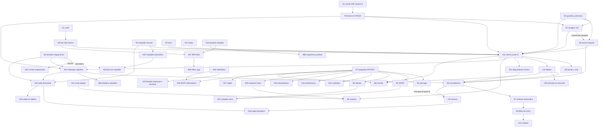

# Plan maestro: EFFORT Control 360

> **Cómo se armó este plan (2026-09-16):** workflow de solo lectura con 124 agentes: 9 lectores por área, un escéptico por cada hallazgo de severidad alta o media, síntesis, crítica de completitud y versión final. Ningún agente escribió archivos ni tocó producción. Lo verifiqué a mano en el código antes de guardarlo: un correo por alerta CRITICA y por destinatario, sin tope (`apps/api/src/servicios/avisosPorCorreo.ts:88-134`), y el primer cálculo automático a los 5 minutos del arranque (`apps/api/src/servicios/programador.ts:324-328`). **Es una propuesta: no cambia el roadmap hasta que Daniel dé las autorizaciones de la compuerta G0.**

Fecha: 2026-09-16. Lo armé en modo solo lectura: leí el repositorio y la auditoría, y no toqué producción. Cuando algo no está comprobado, lo digo con **no verificado**.

---

## 1. Resumen y estado

### Dónde estamos (verificado hoy en el repositorio)

- **Git.** `HEAD` y `origin/main` están en `00efc49`, un commit que solo toca documentación. `git worktree list` muestra un único árbol, `main`. El último commit con código es `4abb606` ("Ver declaración"). La foto del roadmap nombra `d49f700` como "código de la app", pero ese commit solo cambia documentos.
- **Tarea 141 sin commit.** Está implementada en 10 archivos modificados más `verify-report.json`:
  - `packages/importers/src/libroRg90.ts` y su test;
  - `apps/api/src/servicios/liquidacionDeIva.ts`, `repositorios/libroRg90.ts`, `rutas/liquidaciones-iva.ts` y su test;
  - `apps/web/src/api/liquidacionesIva.ts`, `pantallas/LiquidacionIva.tsx` y su test;
  - `docs/DISCREPANCIAS.md`.
- **El último verify está en rojo.** Es de las 2026-09-16T13:09Z, sobre `00efc49` con el árbol sucio. `test:unit` falló por tres motivos:
  - dos timeouts de hooks de 10 s (`importaciones.test.ts:150` y `servidor.test.ts:142`), por carga de la máquina;
  - un `TypeError` en `LiquidacionIva.tsx:257`. Salió de una versión intermedia: `test:unit` corrió cerca de las 09:58 hora local y los archivos web se editaron a las 10:04.
  
  `verify:web` pasó después de esa edición. El reporte mezcla dos estados del árbol y no hay ninguna corrida completa sobre el código final.
- **Nada de la 141 está desplegado.**

### Producción: foto del 2026-09-15 (del roadmap; hoy no la re-verifiqué)

| Qué | Valor |
|---|---|
| Clientes | 5 |
| Usuarios | 1 (`effort360@`, dirección). Las otras 10 cuentas se borraron el 13/09. |
| Documentos | 3.969: 2.526 con tipo y 1.442 en "Otro". La suma da 3.968, así que falta explicar uno. |
| Vencimientos | 150: 42 presentados, 55 vencidos, 27 con días de atraso |
| Alertas abiertas | 83: 55 de vencimientos, 25 de libros, 3 medias |
| Liquidaciones de IVA | 50 (COPESA solo tiene 2025-04 y 2025-09) |
| `hallazgo_libro_rg90` | 4.609 filas, incluidos repetidos viejos |

### Avance real de "100% para mostrar"

- El roadmap dice 5 de 9, pero su propia tabla tiene 4 ✅.
- Uno de esos cuatro, el criterio 6 (tarea 125, aceptar o mandar a revisar), nunca se verificó en producción.
- **Cuenta real: 3 de 9.**
- Con la 141 (criterio 5), la 142 (7), B2 (8) y la verificación del criterio 6 se llega a **7 de 9**.
- Las filas 4 y 9 siguen esperando B1, B3, B4 y la 130.

### Riesgos antes del push de la 141

1. **La primera corrida automática puede inundar alertas y correos.** Corre unos 5 minutos después del despliegue y calcula todo COPESA de 2022 a 2026. Abre alertas CRITICA y manda un correo por cada una, sin interruptor propio ni tope. Cuando existan las cuentas del equipo (B2), Laura y Lilian recibirían cada una todas las CRITICA abiertas. → N6
2. **Los hallazgos de planillas descartadas siguen alertando.** Nada los marca ni los retira. → N10
3. **Puede ganar la planilla equivocada** en tres casos: un empate entre planillas, un fallo al bajar la planilla que manda, o una fila suelta de otro período. → N7
4. **Memoria y tiempo sin tope.** Se abren todos los Excel de libro cada hora dentro de un contenedor de 512 MB, y "Recalcular" hace todo dentro de la petición HTTP, sin candado. → N7
5. **Los respaldos están incompletos.** Ninguno incluye `asignacion_cliente`, `solicitud_documentacion` ni `lectura_de_declaracion`. → N4
6. **Las pruebas corren contra la base de producción** y cada corrida vuelve a otorgar permisos sobre `public`. → N14, N17
7. **El guardia de comandos vive fuera del repositorio**, y los permisos locales dejan pasar `git push` sin preguntar. → N2, D2

### Qué propone el plan

- **Un solo carril de integración**, con un push por vez y verificación en producción después de cada uno.
- **Trabajo en paralelo en worktrees**, como mucho 3 trabajadores a la vez.
- **Compuertas (G0–G15)** donde se espera tu decisión.
- **Una lista única de preguntas** para Lili y Laura.
- **Codex como auditor externo opcional**, siempre desde un worktree de revisión sin datos sensibles.

### Cómo leer este plan

| Prefijo | Qué es |
|---|---|
| RM, DS, A141, P141, T142, T96, T138, OPS, BL | Hallazgos de la auditoría |
| N# | Tarea nueva |
| A# | Autorización que te pido |
| D# | Algo que solo podés hacer vos |
| P# | Pregunta para EFFORT |
| G# | Compuerta (se espera tu decisión) |
| I# | Push del carril |

Cada tarea indica modelo y esfuerzo.

---

## 2. Hallazgos confirmados, agrupados por la tarea que los resuelve

### → N7 (arreglos de la auditoría de la 141, antes del push)

| IDs | Qué pasa | Por qué importa | Arreglo |
|---|---|---|---|
| A141-01 | Si dos planillas empatan (ninguna dice CORRECCION y tienen la misma fecha, o no tienen fecha), gana la primera que devuelve la base. `librosDelCliente` no ordena la consulta (`repositorios/libroRg90.ts:50-60`). | El IVA de un período puede cambiar entre corridas sin que cambie ningún archivo. | Orden total en `prioridad`: después de la fecha, por nombre y luego por `evidenciaId`. Aviso específico de empate. Test que corre la misma entrada en dos órdenes. |
| A141-02, A141-14 | El aviso siempre dice "descartada por existir una más reciente", aunque haya ganado una CORRECCION más vieja o un empate. El test lo fija en la línea 231. Los avisos nombran solo el archivo, y "01 ENERO.xlsx" se repite entre años y entre COMPRAS y VENTAS. | El aviso engaña justo en el caso que hay que preguntarle a Lili (P1). | Motivo según la causa (corrección, fecha o empate), con `rutaOneDrive`. Corregir el test. |
| A141-03 | `periodoDesdeCelda` acepta los meses 00 y 13 y cualquier año de 4 dígitos. Por ejemplo, '2025-13' pasa el filtro de período futuro. | Se crean liquidaciones de períodos que no existen. | Validar mes entre 01 y 12 y un año mínimo (constante con nombre), con tests. |
| A141-04, DS-H02, P141-H06 | Cada combinación período+registro compite sola, sin mirar cuántas filas aporta. Una fila suelta de otro período en una planilla más nueva desplaza el libro real (por ejemplo 568 filas), o arma sola una liquidación. | IVA calculado con una parte mínima del libro. | Período principal por planilla: los grupos secundarios no compiten y se avisan. La regla final se ajusta con los números de N8 y la respuesta a P4. |
| DS-H03, P141-H04, P141-H05 | Las filas con período futuro se descartan con un tope que depende del reloj. El "01 ENERO.xlsx" de COPESA 2026 trae filas 2027-01 … 2032-01, que se van a aceptar cada enero. Probablemente son comprobantes de enero 2026. | Liquidación falsa de 2027-01 en enero de 2027. El IVA de COPESA 2026-01 queda corto sin que se note. | Comparar el período de cada fila con su fecha de emisión, no solo con el reloj. Tests con el reloj en 2027-01 y en 2028-02, y con el archivo guardado de nuevo en 2027. Preguntar P4. |
| A141-05, A141-06, RM-H24, P141-H07, DS-H23 | Cada hora se abren todos los Excel de libro (COPESA: 224) y se retienen las filas de todas las planillas, también las descartadas, sin tope de tamaño. "Recalcular" hace todo dentro de la petición y sin candado compartido con la corrida horaria. | Contenedor de 512 MB (lección 4). Corte por el límite de tiempo del borde de DO (no verificado). Dos cálculos a la vez duplican hallazgos con tasa NULL. | Ordenar por prioridad antes de leer y soltar los grupos perdedores en el momento. Tope de tamaño como fallo visible. Candado compartido `candadoDeIva.ts` (la ruta responde 409). N6 registra memoria y duración. |
| A141-07, P141-H03 | Si la planilla que manda falla al bajarse (429, 5xx, "fetch failed"), gana en silencio la versión vieja. `DriveGraph` no reintenta. | Los hallazgos de la versión vieja se guardan y alertan. | Reintentos en `leer` (solo GET), respetando `Retry-After`. Error tipado `ErrorTransitorioDeDrive`. Si el error transitorio persiste, ese cliente no se escribe en esa corrida y se informa. Un 404 o un archivo roto siguen como fallo. |
| A141-10 | `/correccion/i` busca la palabra en cualquier parte del nombre. "SIN CORRECCION" manda, "CORRECION" no se reconoce, y la tilde funciona pero ningún test lo prueba. | Puede mandar la versión equivocada. | Volver a la regla anclada (después de quitar tildes) `^\s*correcc?ion[\s_\-]` hasta que respondan P3. Tests con tilde, "CORRECION", guion bajo y "SIN CORRECCION". |
| A141-11, DS-H04, P141-H12, T138-10 | Una planilla con todas sus filas rechazadas cuenta como leída y no avisa. `filasRechazadas` guarda el total del cliente en cada período (`liquidacionDeIva.ts:361`). Si la columna de período viene como fecha de Excel, se rechaza la planilla entera. | Se pierde IVA sin rastro, y el número guardado no corresponde al período. | Una planilla 100% rechazada pasa a fallo. Aviso por archivo con rechazos. `filasRechazadas` se calcula con las planillas elegidas para ese período. Aceptar celdas Date. Test con dos períodos y rechazos distintos. |

### → N6 (avisos y alertas seguros)

| IDs | Qué pasa | Por qué importa | Arreglo |
|---|---|---|---|
| P141-T02-H02, BL-01, A141-09 | Unos 5 minutos después del despliegue se calcula COPESA de 2022 a 2026, y sale un correo por cada alerta CRITICA nueva a cada usuario activo de dirección, sin tope ni pausa. Hoy el único destinatario es `effort360@`. Con B2, Laura y Lilian recibirían cada una unas 80 CRITICA abiertas más las nuevas. El único interruptor, `TRABAJOS_AUTOMATICOS`, lo apaga todo. | Correos no aprobados que no se pueden retirar. | `AVISOS_POR_CORREO` (decisión A6), destinatarios explícitos, tope por corrida y correo resumen. Un destinatario nuevo no recibe lo acumulado. Tests de apagado, tope y destinatario nuevo. |
| BL-05, P141-H14, RM-H14 | Las alertas de libro no tienen período mínimo y dicen "Revisalos antes de presentar", incluso para 2022–2024. El título dice "riesgo de multa". | Alertas CRITICA con texto falso, y posible choque con la regla 6. | Período mínimo como constante con nombre y test (A6d). "Presentado o no" se usa solo para elegir el texto: para 2022–2024 no hay vencimientos generados. Cerrar las alertas que quedan fuera del rango con un motivo propio, no con "El problema que la originó ya no existe" (`motorDeAlertas.ts:246-267`), o excluirlas del cierre automático, con test. "Multa", según A6e. |
| P141-H08, P141-H13 | La corrida horaria descarta los avisos y los ignorados, y no registra memoria ni duración del paso de IVA. El comentario de `programador.ts:322` dice que el cálculo corre después de la sincronización, y corre antes (5 min contra 10). | Si nadie aprieta "Recalcular", nadie ve las planillas descartadas. | Log con cantidades, primer aviso, `memoriaMB` antes y después y duración. Sumar los campos a `alerta.evaluadas` sin tocar la condición de `:278-284`. Corregir el comentario. |
| T96-01, T96-02 | `cargarConfiguracion` lee una lista fija (`configuracion.ts:102-118`) sin test. Un valor "Si" o "sí" tumba la API. La guarda `=== 'no'` deja encendido un interruptor cuya clave falta, como pasa en los tests, que no pasan por el chequeo de tipos. | Una variable del panel se ignora sin aviso, o el arranque falla en bucle. | Lista derivada del esquema. Ayudante `interruptor(porDefecto)` que normaliza. Guardas `!== 'si'` para los interruptores que vienen apagados. Nuevo `configuracion.test.ts`. |

### → N10 (hallazgos vigentes)

| IDs | Qué pasa | Por qué importa | Arreglo |
|---|---|---|---|
| P141-H01, DS-H01, A141-08, BL-04 | Los hallazgos no guardan de qué planilla salieron, y `guardarHallazgos` solo inserta. Los de versiones descartadas (FUMIPRO 2026-07, ECOAGRO 2025-02, quizás COPESA 2025-09) quedan PENDIENTE y mantienen abierta la alerta CRITICA. El roadmap (`:789`) dice que se cierran solas. | Habría que aceptar con motivo diferencias de comprobantes que ya no están en el libro usado. | Migración que solo agrega columnas: `vigente`, `visto_por_ultima_vez_en`, `fuera_de_planilla_desde`, `evidencia_id`. Reconciliación por cliente+período+registro, solo en las claves ya decididas y sin clientes con fallos transitorios. Actualizar los importes cuando un hallazgo reaparece. Filtro de vigencia en `riesgoPorPeriodo` y en la pantalla. No se borra nada. |
| BL-03, P141-H11 | El índice `hallazgo_libro_unico` no incluye tipo de registro ni contraparte. `createMany` con `skipDuplicates` descarta en silencio un hallazgo de IVA de otro proveedor, o del otro registro, con el mismo número, tipo y tasa. | Se pierden avisos de posible multa. | Recrear el índice con 7 columnas en la misma migración, sin `NULLS NOT DISTINCT` y sin borrar filas. Test de integración con dos proveedores y con COMPRAS/VENTAS. |
| P141-H09, BL-14 | La propuesta de limpieza cita un respaldo del 14/09 y un conteo viejo, no toca `schema.prisma` y usa `BEGIN/COMMIT` de nivel superior, que el arnés puede no tolerar (no verificado). | Aplicarla así deja el esquema y la base desalineados, o falla. | N10 deja escrito el plan técnico (`@@unique` de 7 columnas y conteo por separado). El texto lo corrige N3. Aplicarla sigue siendo B6(a). |

### → 141 (cierre: verify, push y verificación)

| IDs | Qué pasa | Por qué importa | Arreglo |
|---|---|---|---|
| RM-H03, A141-13, P141-H10, OPS-14 | El reporte del árbol dice `todo_verde=false` y mezcla estados: `test:unit`, `typecheck` y `lint` corrieron antes de las ediciones web de las 10:04, y `verify:web` después. Los dos timeouts de hooks salieron por carga, y esos mismos archivos pasaron corridos solos. | No existe una corrida completa sobre el código final. | Verify completo con el árbol quieto y el candado del carril, que también frena las pruebas de los trabajadores. Si solo fallan los timeouts, confirmarlos aislados y anotarlo. El reporte rojo no se commitea (A1). |
| P141-H05 | COPESA 2026-01 puede quedar incompleto y parecer correcto: el criterio de hecho de la 141 solo pide ver períodos de 2025 y 2026. | La verificación pasaría con IVA faltante. | Chequeo de cuadre en I1. Las fuentes están en la fila 141 de la sección 3. |

### → N1 (carril) y N2 (guardia y permisos)

| IDs | Qué pasa | Por qué importa | Arreglo |
|---|---|---|---|
| OPS-12, OPS-18, OPS-20 | Bajar el `.js` solo prueba la web, y la API no expone versión. No hay protocolo escrito del carril. Los scripts se conectan como dueño de la base, sin transacción READ ONLY. | Una web nueva con una API vieja pasa inadvertida. Una consulta "de lectura" tiene poder de escritura. | `esperar-despliegue.mjs`, SHA en el panel y una señal positiva de la API (no la ausencia de algo). `consultar-produccion.mjs` en transacción READ ONLY. Sección nueva en `DESPLIEGUE.md`. |
| OPS-01, BL-16 | El guardia vive en `NexusFlow AI/.claude`, sin versionar. Si su archivo no está, deja pasar el comando, porque solo el código de salida 2 bloquea. | Una sesión abierta en `effort-control-360` o en un worktree queda sin guardia, y desactivarlo no deja rastro. | Versionar el guardia en `effort-control-360/.claude`. Que el hook falle cerrado. Pruebas del guardia dentro de verify. |
| OPS-07 | `settings.local.json` permite `git push *`, `npx prisma *` y `node -e ' *` sin preguntar. | Contradice `CLAUDE.md:312`. Con agentes en paralelo, un push cancela el despliegue de otro. | D2 (lo hacés vos). |
| OPS-08, OPS-09, OPS-10 | **Falsos positivos:** hoy bloqueó un `grep` por la palabra "truncate", y no acepta los here-strings de PowerShell. **Falsos negativos:** `Remove-Item -Recurse`, `git restore`, `stash drop`, `branch -D`, `push --delete`, `git -C x push --force`, `rm -r -f`, `doctl apps delete/update`, `supabase db reset`, `migrate resolve`, y un heredoc sin comillas con `$(...)`. Las pruebas escriben en el log real. | Los bloqueos inútiles empujan a desactivarlo, y los huecos son reales. | Revisar el comando por tramos. Excepciones solo para lectura. Aceptar here-strings `@'...'@` con comillas simples. Casos nuevos en `probar-guardia.mjs`. Log alterno para las pruebas. |

### → N3 (verdad documental)

| IDs | Qué pasa | Por qué importa | Arreglo |
|---|---|---|---|
| RM-H01, RM-H09 | La Cola A dice "sin necesitar a Daniel", pero toda tarea necesita un push con permiso y tu sesión. Hay tres definiciones distintas de "terminado". | Una conversación nueva podría pushear sin preguntar, porque los permisos locales lo permiten. | Reescribir el encabezado de la Cola A y el apartado "Al terminar" de `CLAUDE.md`: verify decide si el código está listo; la tarea se cierra con su "Hecho cuando". Leyenda de `[x]` con fecha de corte. |
| RM-H02, RM-H07 | La 141 sigue como `- [ ]` y no como `[~]`. El bloque de renumeración sigue escrito como orden, y `CLAUDE.md:304-305` pide "corregir la numeración". | Riesgo de reimplementar la 141, o de renumerar y romper todas las referencias. | Marcar `[~]` con una nota de estado y cambiar el grep de arranque a `^- \[[ ~]\]`. Los números son fijos (la próxima tarea es la 143), en `CLAUDE.md` y en "Cómo leer". |
| RM-H04, RM-H31 | El conteo dice 5 de 9 con 4 ✅, y el criterio 6 no tiene verificación en producción. Tampoco la tienen 95, 98, 126 ni 127. Las tareas 120 y 122 están `[x]` a medias. El respaldo diario no figura en el roadmap. | El avance está sobrestimado. | Poner 3 de 9, con el criterio 6 en ⚠️ hasta A11. 95 y 98 pasan a `[~]` hasta verificarlas. 127: "reemplazada por la 141". 120 vuelve a `[ ]` (→ N18) y 122 a `[~]` (→ N19). Notas en 57 y 119. El respaldo diario pasa a ser tarea (→ N15). |
| RM-H10, RM-H11 | `CLAUDE.md` sigue con el estado del 13/09, no tiene las reglas del 15/09 y todavía admite escribir en carpetas reales "con EFFORT presente". | Es el archivo que se carga solo en cada sesión. | Recuadro nuevo que remite a la foto. Agregar las reglas que faltan. Cerrar esa vía de escritura con fecha, sin borrar el antecedente. |
| RM-H15, RM-H16, RM-H20, RM-H21, RM-H25 | La tabla de la 119 está desactualizada. La 112 dice que cierra la discrepancia 1, que ya está cerrada. La 98 promete "id del proveedor" (se guarda fecha y destinatario). La 97 pide `origen=AUTOMATICO`, cuando el campo correcto es `origen_contacto`. La 127 no dice que la 141 la reemplazó. | Instrucciones que llevan a errores. | Notas fechadas en cada tarea. Texto de la 97 corregido, incluido a qué usuario del sistema se atribuye el contacto. |
| RM-H29, RM-H30 | La bitácora termina el 10/09 y tiene entradas ya superadas. B5 no dice que el job de migraciones nunca se creó en la app real. | Se pueden seguir decisiones viejas. | Marcas "(superado el …)" y entradas cortas del 11 al 15. Nota en B5. |
| DS-H10, BL-08, DS-H09, DS-H11, DS-H15 | B7 no tiene la pregunta de CORRECCION ni el caso de COPESA agosto 2025. A la guía le faltan las declaraciones sueltas. La pregunta de la prórroga está repetida y 23(c) la da por cerrada. El período del piloto figura como "confirmado". | Las preguntas no llegan a la reunión. | Lista única de la sección 6 en B7 y en `GUIA-DEMO.md`. Notas fechadas en 19(f), 23(b) y 23(c). Punto nuevo 31 (declaraciones sin prueba). |
| DS-H07, OPS-11 | El encabezado de `limpiar-hallazgos-repetidos.sql` y `.do/app.yaml:140-142` dicen que el job de migraciones corre en cada despliegue. | Alguien confía en eso y pushea código que necesita una migración. | Corregir los textos. El bloque `jobs:` queda marcado "no activo, ver B5". |

### → 142 (tablero de Documentos)

| IDs | Qué pasa | Por qué importa | Arreglo |
|---|---|---|---|
| T142-01 | "Sin iniciar" y "Recibidos" salen solo de filas manuales de `proceso_mensual`, y hay 0 filas. | Los 5 clientes aparecen "Sin iniciar" aunque tengan documentos del mes. | Resumen por cliente contado desde `documento`, en el servidor y con cartera. "Sin iniciar" queda solo en la columna Estado. |
| T142-04 | Cada versión guardada de un archivo crea otro documento, y la anterior queda. | Infla "recibidos". | Contar solo versiones vigentes (`evidenciaId` nulo o con fila en `archivo_de_origen`), sin migración. |
| T142-12 | Las fechas del proceso mensual vuelven con hora, y el formulario no las puede volver a guardar (400). | Un proceso con fecha no se puede guardar dos veces seguidas. | Convertir a AAAA-MM-DD en la API (`procesoASalida`) y `.slice(0, 10)` en la web, con tests. |
| RM-H23, T142-05…09, T142-14, DS-H05 | Hay un contador manual con el mismo nombre. El alta manual guarda a medianoche UTC. El filtro por fecha trabaja en UTC y en el navegador. El encabezado dice "Período X" en modo fechas. Los errores tapan la pantalla. No hay tests de la lista. El comentario sobre `dias_alerta` (`fechas.ts:113-116`) es falso. | Dos cifras distintas para lo mismo, y días corridos. | Todo dentro del diseño de la 142, incluida la corrección del comentario de `fechas.ts`. |

### → 96, 97 y 99 (recordatorios)

| IDs | Qué pasa | Por qué importa | Arreglo |
|---|---|---|---|
| T96-03 | `envio_notificacion` no tiene clave única, y el candado vive en memoria. | Un reinicio entre el 202 de Graph y la actualización del contador reenvía el recordatorio. | Índice único parcial. Reservar, enviar y confirmar en una transacción. Estado DESCONOCIDO para reservas colgadas. |
| T96-04, RM-H19 | `envio_notificacion.solicitud_id` guarda el id de la alerta, y `enviados()` mezclaría alertas con recordatorios. | La auditoría queda ambigua. | Filtrar `numeroDeRecordatorio: null` en `enviados()`. Método propio `registrarRecordatorio` con los campos obligatorios. |
| T96-05, RM-H21 | El puerto de contactos no admite `solicitudId` ni un vínculo con el envío. | El contacto automático queda sin evidencia. | `registro_contacto.envio_id` (96). `solicitudId` y `envioId` en el puerto, y el contacto insertado dentro de la confirmación (97). Arreglar la ruta manual, que hoy descarta el `solicitudId`. |
| T96-06 | La regla que propone la pantalla le escribe al responsable interno, no al cliente. | La constancia contaría como "intento de contacto" un correo que el cliente nunca recibió. Además, `registro_contacto` no se puede corregir ni borrar (disparador y REVOKE). | Registrar el contacto solo si una dirección de tipo CLIENTE aceptó el envío, con tests. Aviso en Reglas cuando la regla no le escribe al cliente. La prueba controlada nunca escribe una dirección ajena en `cliente.email` de un cliente real (A24). |
| T96-07 | En producción probablemente no hay correos de clientes ni asignaciones de cartera (no verificado). | Nadie recibiría nada, o solo el propio remitente. | Convertidor de destinatarios con un test por tipo. Si la lista queda vacía, no se envía ni se cuenta. La vista previa muestra "sin destinatario". Las consultas de N9 lo confirman. |
| T96-08 | El botón de Seguimiento cuenta el plazo desde el día 1 del mismo período, y reabrir la solicitud no lo corrige (no existe una ruta para cambiarlo). | Todas vencen alrededor del 4 del mes, pidiendo documentación de un mes que no terminó. | Contar desde el día 1 del mes siguiente, que es la convención de los tests, con un test. Revisar las solicitudes ya abiertas con una consulta de N9. Corregirlas es un UPDATE autorizado (A42), con un script que primero simula. |
| T96-09 | La pantalla dice que los recordatorios "salen solos". Hay comentarios sobre AGOTADA y sobre la "Parte 6" que son falsos o van a quedar viejos. | Lección 7: un comentario que miente es un bug. | El texto de pantalla se corrige antes, en N11. En la 96, los textos dependen del estado real: encendido, correo configurado y regla activa. |
| T96-12, T96-13 | La pantalla usa la primera regla activa sin mirar `reglaId` ni `clientesAlcanzados`. `correspondeEnviar` no mira la hora ni si el día es hábil. | La pantalla anuncia avisos distintos de los que salen. Podrían salir envíos a las 00:42, a las 23:05 o en sábado. | `elegirReglaDeDocumentacion` en core, usada por la pantalla, el trabajo y `abrirParaTodos`. Ventana de envío con día hábil y hora de Paraguay. Un tope horario solo si lo decidís vos. |
| T96-14, RM-H20 | Graph no informa rebotes ni devuelve un id del mensaje, y no hay permiso para leer la casilla. | "Si rebota" no se puede cumplir hoy. | La 99 cubre los errores inmediatos con un error tipado y "Referencia: <id>", con el id generado antes de enviar. Los rebotes pasan a N22. |
| T96-15 | Los reintentos no tienen tope. | Se acumulan filas FALLIDO cada hora. | Presupuesto de envíos compartido por corrida, como mucho 3 intentos por día, y los recordatorios después de los avisos. |
| T96-10, T96-11 | Seguimiento falla entera para tres roles (403) y marca "agotados" cuando no hay regla. | La pantalla queda inutilizable para parte del equipo. | N11 lo arregla con lo mínimo, antes de la 96. La 96 después reemplaza esa lógica y su test. |

### → 138 (saldo declarado del formulario 120)

| IDs | Qué pasa | Por qué importa | Arreglo |
|---|---|---|---|
| RM-H22, T138-03 | El detector nunca vuelve a leer un PDF, y `guardarLectura` reescribe la fila entera. | Las columnas nuevas quedarían en NULL en las 2.434 lecturas, y un fallo pasajero podría borrar una presentación ya reconocida. | Columna `version_de_lectura`. La relectura usa el cupo que sobra y solo hace UPDATE de las columnas nuevas. Si falla, no toca la fila. |
| T138-04 | Para los saldos vale la ÚLTIMA declaración (la rectificativa), pero el detector toma la PRIMERA. Además, hay copias del mismo PDF con distinto sha256. | Se mostrarían los saldos de la original. | Consulta propia: deduplicar por número de orden y elegir la declaración que ninguna otra rectifica (casillas 01, 02 y 03). Si eso no decide, por fecha y hora. Si hay empate, no elegir y avisar. |
| T138-05 | El crédito declarado no coincide con la suma por comprobante (en la muestra hay 5 Gs de diferencia). | Una comparación exacta marcaría casi todos los períodos. | Aplicar tu criterio de "desde 1 Gs, aceptar o revisar" como constante con nombre. Comparar casilla por casilla, con signo. Usar la casilla 46 como saldo anterior. |
| T138-06 | Los rubros 4 y 5 están en la página 2, y pdfjs puede partir los importes. | Saldos ilegibles o mal leídos. | Corregir el comentario de `textoDePdf`. Quitar el espacio antes del punto solo dentro del importe. Validar las cuentas internas del formulario. Un saldo ilegible queda en NULL y la pantalla dice "no se pudo leer". |
| T138-07 | El cálculo de cada período no arrastra el saldo anterior. | Aparece "A pagar" en rojo en períodos que se declararon a favor. | Leer también las casillas 51, 52, 169, 54 y 58. Mostrar el saldo técnico calculado con arrastre, el técnico declarado, el a pagar declarado y una marca cuando no coinciden. |
| T138-08, T138-09 | La 138 toca los mismos archivos que la 141, y su migración tiene que aplicarse antes del push. | Conflictos, y producción rota si el código llega antes que la migración. | Empezarla con la 141 verificada y N10 integrada. Revisar que la migración sea solo ADD COLUMN con nulos o con valor por defecto. Respaldo, `migrate deploy` a mano y después el push. Si B5 = automático, lo aplica N29. |
| BL-12 | La 112 no se puede automatizar sin guardar los importes declarados. | Obligaría a otra migración más adelante. | Agregar débito y crédito declarados en esta misma migración. |
| T138-13 | Las liquidaciones de períodos que ya no se producen nunca se reemplazan (no verificado que existan). | Se compararían contra la declaración como si fueran actuales. | Mostrar `calculadoEn` en la fila. No borrar. |

### → N4 y N15 (respaldo)

| IDs | Qué pasa | Por qué importa | Arreglo |
|---|---|---|---|
| T138-01, T138-02, OPS-05 | Ningún respaldo incluye `asignacion_cliente`, `solicitud_documentacion` ni `lectura_de_declaracion`. El manual pide "contacto" y "solicitud", que no existen, y los saltea con un simple aviso. | Un respaldo "completo" no permite restaurar carteras, solicitudes ni lecturas, y restaurar los contactos falla por clave foránea. | Una lista única en `packages/core`, importable por la API y, desde `dist`, por el script (N4). Un test la compara con los modelos de Prisma. Error ante un nombre desconocido. El respaldo automático usa esa lista y avisa lo que saltea (N15). |
| OPS-06, RM-H12, T138-11 | No hay `docs/RESPALDO.md` (y `CLAUDE.md` lo cita) ni forma de restaurar. El JSON guarda los secretos TOTP en claro. Nunca se vio el respaldo automático funcionando en producción. | No se sabe si un respaldo sirve. | Documento, script de restauración a una base vacía, simulacro, decisión tuya sobre los secretos (A16) y verificación en OneDrive (N15). |
| OPS-13 | El primer respaldo espera 30 minutos desde cada arranque y carga todo sin interruptor. | Con reinicios seguidos, no hay respaldo ese día. | Chequeo cada hora de "¿ya existe el de hoy?", con interruptor propio, tope antes de cargar y fecha de Paraguay en el nombre (N15). |
| OPS-02 | Un servidor e2e que quede vivo 30 minutos o más (modo UI o corrida colgada) sobrescribe el respaldo del día con datos de prueba. | El respaldo del día queda con basura. | Respaldo solo con `NODE_ENV=production` (N15). Servidor e2e sin credenciales de Azure y con los trabajos apagados (N14). |

### → N14 (pruebas aisladas) y N17 (permisos en producción)

| IDs | Qué pasa | Por qué importa | Arreglo |
|---|---|---|---|
| OPS-03, OPS-04 | Las pruebas de integración y e2e crean esquemas en la base de producción. Cada corrida vuelve a darle a `effort_app` permisos sobre `public`, incluido UPDATE sobre `event_log` y `registro_contacto`, y el REVOKE se aplica al esquema de prueba en vez de a `public`. | La segunda barrera de auditoría está debilitada, y en `registro_contacto` directamente no existe. | Reescribir `SCHEMA public` como el esquema de prueba en `entorno.ts`, con una verificación. Consulta de solo lectura y REVOKE autorizado (N17). Decidir si se usa una base de pruebas separada. |
| OPS-14 | Verify no puede correr en paralelo (usa puertos fijos) y su reporte no dice si el árbol cambió durante la corrida. | Hay reportes que no corresponden a ningún estado real del código. | Huella del árbol al inicio y al final. Abortar si los puertos están ocupados. Verify solo en el carril, con el candado que también frena las pruebas de los trabajadores. |
| OPS-19 | En los worktrees sin `.env`, la integración se saltea y figura como OK. | Verde falso. | Marcar PENDIENTE "sin base" en el reporte y usar `EXIGIR_BASE=1` dentro de verify. No copiar `.env`. |
| DS-H19 (DS-12) | El cuerpo del punto 12 describe un check de `npm audit` en rojo que ya no existe. | La excepción puede no estar vigente. | Revisar las excepciones de los puntos 12 y 14 al tocar `verify.mjs`. |

### → N13 y B5 · N29 · N16 y 118 · N12 y B2 · B1 · 130 · N18 · N19 · N20 · N21 · N26 · N30 · N31

| IDs | Qué pasa | Por qué importa | Arreglo | Tarea |
|---|---|---|---|---|
| BL-10 | Si se activa `migrar-base`, cualquier SQL se aplica con el push, sin respaldo. Además, la documentación se contradice. | Se incumpliría la regla 3 en cada push. | Recomendado: seguir con migraciones a mano, con un control al arrancar que solo avisa y el procedimiento documentado (N13). Si elegís automático: el job hace el respaldo en OneDrive antes de migrar (N29), y se activa desde el panel, no con doctl. | B5 → N13 o N29 |
| OPS-16, OPS-17 | Actualizar la tabla de feriados no mueve los vencimientos ya guardados, por `skipDuplicates`. El aviso de "años sin revisar" salta cada hora por 2027. | Quedan fechas viejas. Los más expuestos hoy son los períodos 2026-10 y 2026-11, si se decreta un feriado extraordinario. | Script que por defecto solo simula, excluye los ajustes hechos a mano (B1) y los presentados, cierra las alertas con motivo y deja todo en la bitácora. Aviso solo para años con fechas generadas. | N16 |
| DS-H06, DS-19(c)4 | Varios comentarios dicen que sin el traslado cargado el sistema "avisa antes, nunca después", y es falso (en 2028 y 2029 puede avisar un día tarde). Además faltan los números de decreto del 1/3 y del 20/6 (`diasHabiles.ts:287` y `:293`). | Hay comentarios falsos en 5 lugares, y trazabilidad incompleta. | Corregirlos y citar los decretos. Qué tipo de error se prefiere lo decidís vos. | N16 |
| RM-H26 | La 118 perdió el disparador "cuando el gobierno confirme un traslado", no puede repetirse siendo una sola casilla y no nombra `FERIADOS_EXTRAORDINARIOS`. | Un decreto de septiembre no se cargaría hasta octubre. | Tarea recurrente (nunca `[x]`), disparada en la primera semana de cada mes o cuando salga un decreto. Revisión explícita de 2027 antes de cargar su fecha. | 118 |
| BL-02, BL-15 | `crear-equipo.mjs` no valida la contraseña como la pantalla, no deja nada en la bitácora, no guarda `creado_por` y no muestra a qué base se conecta. B2 no pide respaldo. `crear-usuario-de-arranque.mjs` tiene un comentario que contradice el código. | Altas sin rastro, en una bitácora que ya se perdió una vez. | Usar el `hashearContrasena` compilado, mostrar el host y pedir "SI", guardar `creado_por` y el evento en la misma transacción. B2 con respaldo previo. | N12 |
| DS-16 | No hay procedimiento para cuando alguien pierde el segundo factor. | Se vuelve urgente en el momento en que existen las 10 cuentas. | Procedimiento escrito antes de crear las cuentas. | N28 → B2 |
| BL-07 | B1 propone el 30/06 para todos, pero ese día es feriado y la fecha correría al 01/07. Leída por terminación de RUC, los tres clientes presentaron a tiempo (cuenta a mano, no verificada). | Se podría cargar una fecha equivocada. | Preguntar P7 completa. Aplicar con un UPDATE de las 5 filas, citando la fuente. Si es por terminación de RUC, usar la tabla de informativas. | B1 |
| BL-06 | El índice solo evita duplicar alertas abiertas, y el motor no recibe los vencimientos presentados. | Una alerta que cerraste a mano volvería cada hora. | Usar `listarPresentados`, agregar `entidadesConAlerta(origen)` que incluya las cerradas, cerrar solo cuando el atraso llegue a 0 y compartir el cálculo con la vista de atrasos. Con eso, la 130 se puede construir antes de B1. | 130 |
| DS-H08 | `iva.ts` dice que las tasas salen de `regla_impositiva` y pide no usar en producción la constante que producción efectivamente usa. | Editar una tasa en Reglas no cambia ningún cálculo. | Conectar la tabla, con vigencia por período y error visible si falta, o corregir los comentarios y avisarlo en la pantalla de Reglas. | N18 |
| T142-10, T142-13 | El tablero muestra un saldo de IVA escrito a mano y la pantalla de IVA muestra otro calculado. El PUT permite dejar cargados los dos saldos a la vez. | Dos cifras distintas para lo mismo, contra la regla 6. | Hacerlo después de la 138. Validar sobre el estado combinado. | N19 |
| T142-02, T142-03 | El período de los documentos de OneDrive se calcula en UTC. Un comentario dice que eso está anotado en DISCREPANCIAS, y no lo está. | Los archivos del borde de mes caen en el mes siguiente. | Hora de Asunción, filtros coherentes y recálculo de las filas existentes con un script que primero simula. | N20 |
| DS-H22, BL-09 | La sincronización tiene una sola carpeta por cliente. B4 no pregunta por las declaraciones que faltan y no son talones. | Una respuesta de EFFORT puede exigir cambiar el modelo. | B3 y B4 ampliados (P10–P12). Si hace falta, N21. | N21 |
| DS-7 | `effort_app` no tiene contraseña, y no está verificado con qué usuario conecta producción. | Para pasar a mínimo privilegio falta una escritura en producción. | ALTER ROLE lo corrés vos (A36), con las 9 comprobaciones de DISCREPANCIAS 7. | N26 |
| DS-H12 | Si Lili dice que EEFF va por el calendario de informativas, los vencimientos ya generados no se actualizan. | Quedan fechas viejas. | Tarea condicional que reutiliza el script de N16. | N30 |
| RM-H33 | "Ver declaración" devuelve el enlace al original sin dejar rastro en la bitácora. | Acceso sin registro. | Si A33 elige registrar, se implementa. | N31 |

### Hallazgos menores (sin verificación adicional) y la tarea que los absorbe

| IDs | Tarea |
|---|---|
| RM-H05, RM-H06, RM-H08, RM-H13, RM-H18, RM-H27, RM-H32, RM-H35, DS-H13, DS-H14, DS-H16, DS-H17, DS-H18, DS-H20, DS-H21, DS-H24, P141-H16, T138-12 | N3 |
| RM-H28, OPS-15, OPS-21 | 116 |
| RM-H34 | N8 (la entrada de bitácora) |
| A141-12, A141-15, A141-16, A141-17, A141-18, A141-19, A141-20 | N7 |
| P141-H15 | P2 y la verificación de I1 |
| T142-06, T142-07, T142-08, T142-09, T142-11 | 142 (T142-11 solo como nota para una limpieza posterior) |
| T96-16 | 99 |
| T96-17, T96-18, T96-19 | 96 (tests, `NODE_ENV=production` para encender y sección de interruptores) |
| BL-11 | P27 |
| BL-13 | B6(b) |
| BL-17 | P20 y A33 |

---

## 3. Grafo de tareas

**Carriles:**
- **Claude:** trabajo que Claude hace solo.
- **Daniel:** necesita a Daniel.
- **EFFORT:** necesita respuesta de EFFORT.
- **Infra:** infraestructura o carril de integración.

**Todo push pasa por el carril, de a uno.**

| ID | Qué | Depende de | Archivos que toca | Carril | Autorización de Daniel | Hecho cuando | Modelo y esfuerzo |
|---|---|---|---|---|---|---|---|
| N1 | **Carril de integración y verificación.** Candado y secuencia del carril. Espera del despliegue con tres pruebas: bundle, SHA y una señal positiva de la API. Protocolo de verificación sin contraseña. Scripts nuevos: `esperar-despliegue.mjs` (solo GET públicos) y `consultar-produccion.mjs` (transacción READ ONLY, sin imprimir URLs). | — | `scripts/esperar-despliegue.mjs`, `scripts/consultar-produccion.mjs`, test del script de consulta, texto para `docs/DESPLIEGUE.md` (lo aplica el integrador) | Claude + Infra | A5 | Hay un test que comprueba que un UPDATE falla. El test abre la transacción READ ONLY sobre el esquema `pruebas_*` del arnés (nunca sobre `public`), corre solo en el carril y lleva las tres preguntas escritas. DESPLIEGUE.md describe el carril. I1 se hizo con este procedimiento. | Opus 5 · high |
| N2 | **Permisos y guardia** (OPS-01, 07, 08, 09, 10). El guardia falla cerrado, revisa por tramos, acepta here-strings y agrega casos nuevos. Log alterno para las pruebas. N2 solo registra el hook y las pruebas. **Las reglas allow/ask/deny las escribís vos, también en la copia versionada.** | — | `NexusFlow AI/.claude/guardias/*` y el hook de `NexusFlow AI/.claude/settings.json` (cada cambio se te muestra antes); `effort-control-360/.claude/guardias/*` y el bloque de hook de `effort-control-360/.claude/settings.json` (nuevos); `.gitignore` (log del guardia) | Daniel + Infra | A3, D2 | `probar-guardia` pasa los casos nuevos sin escribir en el log real. Una sesión en la raíz y otra en un worktree bloquean el caso conocido. `git push` pide permiso. Viaja en I1. Hasta que llegue a main, el hook activo sigue siendo la copia (ya corregida) de `NexusFlow AI/.claude/guardias`. | Opus 5 · high |
| N3 | **Pasada de verdad documental** (sección 2 → N3). | Decisiones de N6 y N7 | `docs/ROADMAP-MAESTRO.md`, `CLAUDE.md`, `docs/DISCREPANCIAS.md`, `docs/GUIA-DEMO.md`, `docs/BITACORA-ONEDRIVE.md` (incluida la entrada de N8), encabezado de `docs/propuestas/limpiar-hallazgos-repetidos.sql`, comentarios de `.do/app.yaml` | Claude (integrador) | A7 | El grep de arranque muestra la 141 como `[~]`. El conteo dice 3 de 9 (criterio 6 en ⚠️ hasta A11). CLAUDE.md no contradice las reglas del 15/09. B7 y GUIA-DEMO tienen la lista única. Viaja en I1. | Sonnet 5 · medium |
| N4 | **Respaldo manual completo.** Lista única de modelos en `packages/core`: agrega `asignacionCliente`, `solicitudDocumentacion` y `lecturaDeDeclaracion`; quita `contacto` y `solicitud`; excluye `sesion` y dice por qué. El script la importa desde `packages/core/dist` (como `reclasificar-documentos.mjs`); `apps/api` no puede importar desde `scripts/` porque su `rootDir` es `./src`. Corta con error ante un nombre desconocido. | — | Módulo nuevo en `packages/core/src` (p. ej. `modelosDelRespaldo.ts`) y su export en `index.ts`, `scripts/respaldar-base.mjs`, `apps/api/test/respaldo-modelos.test.ts` | Claude | A16 (qué hacer con `codigoRecuperacion`) | El test falla si falta un modelo o si sobra un nombre. El respaldo previo a I1 lista las tablas nuevas con sus filas. | Sonnet 5 · medium |
| N5 | **Codex como auditor.** Instalar la CLI y el plugin, apagar el entrenamiento, cambiar el modelo en `config.toml` y hacer una revisión de prueba. | — | `~/.codex/config.toml`, plugins de Claude Code (los tocás vos) | Daniel + Infra | A38, A40, D11 | Una revisión adversarial de prueba terminó en el worktree de revisión, sin `.env` ni `docs/Muestras`. | Sonnet 5 · medium |
| N6 | **Avisos y alertas seguros.** `AVISOS_POR_CORREO`, destinatarios explícitos, tope por corrida y resumen. Un destinatario nuevo no recibe lo acumulado. Período mínimo para las alertas de libro como constante con nombre; presentado o no presentado solo elige el texto; las alertas que quedan fuera del rango se cierran con motivo propio. Configuración derivada del esquema, con interruptores normalizados. En el paso de IVA del programador: registro de memoria, duración, avisos e ignorados; uso del candado; `ahora` pasado al servicio; comentario de `:322` corregido. | I0, G1, commit del candado de N7 | `apps/api/src/configuracion.ts`, `servicios/{programador,avisosPorCorreo,motorDeAlertas}.ts`, tests de avisos, motor y configuración (este último nuevo); texto para `.env.example`, `.do/app.yaml` y `DESPLIEGUE.md` | Claude → Daniel | A6, D9 | Pasan los tests de apagado, tope, destinatario nuevo, período mínimo y cierre con motivo propio. Después de I1, `envio_notificacion` no creció más que el tope y Alertas no dice "antes de presentar" en períodos ya presentados. | Opus 5 · high |
| N7 | **Arreglos de la auditoría de la 141** (sección 2 → N7). **El primer commit es el candado** (`candadoDeIva.ts`, contrato 7.3 #2). | I0, N8 (regla de período principal), N2 | `servicios/liquidacionDeIva.ts`, `servicios/candadoDeIva.ts` (nuevo), `repositorios/libroRg90.ts`, `rutas/liquidaciones-iva.ts`, `packages/importers/src/{libroRg90,archivo}.ts`, `packages/drive/src/adaptadorGraph.ts`, `apps/web/src/{api/liquidacionesIva.ts,pantallas/LiquidacionIva.tsx}`, tests, comentario de `schema.prisma` | Claude | — (trabajo local) | Tests nuevos en verde: empate en dos órdenes; CORRECCION (con tilde, "CORRECION", "SIN CORRECCION"); mes 13; reloj en 2027-01; planilla ganadora que falla al bajarse; planilla 100% rechazada; grupo secundario; tope de tamaño; respuesta 409; `filasRechazadas` por período (dos períodos con rechazos distintos guardan cada uno lo suyo). | Opus 5 · xhigh |
| N8 | **Lectura de solo lectura de las copias del sistema** (effort360@, `EFFORT Control 360/Entrada`) de COPESA, FUMIPRO y ECOAGRO. Relevar: períodos por archivo, fecha de emisión frente a período, cantidad de filas del "01 ENERO.xlsx" de COPESA 2026 y tamaños y fechas de las versiones en conflicto. Simular, sin escribir, qué planilla elige cada período, qué hallazgos quedan huérfanos y cuántas alertas y correos nuevos habría. **Corre en el árbol principal todavía en `tarea/141`, antes de volver a main.** | A4, commit WIP de I0 | Script en el scratchpad (no se versiona); texto de la entrada para `docs/BITACORA-ONEDRIVE.md` (lo commitea N3) | Daniel | A4 | Los números quedan en DISCREPANCIAS 25 y la lectura en la bitácora. Tenés la estimación antes de G2. | Sonnet 5 · high |
| N9 | **Foto de producción de solo lectura, antes y después** de cada push con efectos: alertas por origen y criticidad; `envio_notificacion` por estado; hallazgos; liquidaciones (incluidas las de períodos posteriores al mes en curso); `has_table_privilege` de `effort_app`; esquemas `pruebas_*`; reglas; solicitudes (y cuántas tienen `cuenta_desde` en el mismo mes del período); clientes con email; lecturas del formulario 120; saldos manuales; `_prisma_migrations`; total de documentos. | N1, A5 | Ninguno (resultado en la conversación y resumen en el roadmap) | Daniel | A5 | Las fotos de antes y después de I1 quedan anotadas y coinciden con la estimación de N8. | Sonnet 5 · medium |
| 141 | **Cierre de la 141:** verify con el árbol quieto; integración (squash de `tarea/141` con N7, y después N6, N4, N1, N2 y N3); revisión de Codex; respaldo; un push; espera; verificación; foto posterior. | N2, N3, N4, N6, N7, N8, N9, G2 | `verify-report.json` (solo en verde) más lo de N2, N3, N4, N6 y N7 | Infra + Daniel | A8, A9, A10, A11 (recomendado), A40, D1, D3, D9 (si A6 lo requiere) | Verify en verde, con la salida pegada. Un solo push. En IVA de producción, COPESA muestra 2025 y 2026 con compras y ventas, y ningún período posterior a 2026-09. Ningún cliente tiene liquidaciones futuras. La corrida horaria no reinicia el contenedor (se ve en el log de memoria). Los avisos se pueden ver. En COPESA 2026-01 cuadra: comprobantes de compras (pantalla o consulta A5) + filas rechazadas de esa planilla (aviso del archivo o `filasRechazadas` por período de N7) = filas del archivo (conteo de N8). | Sonnet 5 · medium (Opus 5 · high si verify falla) |
| 116 | **Medir el pooler 6543 y verificar la 126.** Desde local: 30 `SELECT 1` por cadena. Desde la API: `responseTime` de `/csrf` frente a GET autenticados. Vos mirás los parámetros de `DATABASE_URL` (`pgbouncer`, `connection_limit`, usuario) sin pegar la URL. Además, dos conteos de `hallazgo_libro_rg90` después de la primera corrida posterior a I1, separados por al menos una corrida horaria y sin ningún despliegue entre ellos. | I1 desplegado, sin verify corriendo | `docs/DISCREPANCIAS.md` (punto 18), `docs/ROADMAP-MAESTRO.md` (126) | Daniel | A12, D3 | El punto 18 tiene las dos mediciones con su origen, los parámetros y la conclusión, sin cambios de configuración. El total de hallazgos no crece entre los dos conteos (o se anota que la 126 no se cumple). | Sonnet 5 · medium |
| B5 (131) | **Ver si `migrar-base` existe en el App Spec vivo** y elegir entre migraciones manuales (recomendado) o automáticas. | — | App Spec (vos) | Daniel | A13, D3 | La decisión queda escrita en DISCREPANCIAS 29. | Sonnet 5 · low (para registrar la decisión) |
| N13 | **Si B5 es manual:** al arrancar, un control de migraciones pendientes que solo lee y avisa. Comentario de `app.yaml` fiel a la realidad y procedimiento en `DESPLIEGUE.md`. | B5 = manual | `apps/api/src/arrancar.ts`, test nuevo; textos de `app.yaml` y `DESPLIEGUE.md` | Claude | A15 | Si falta una migración, el log avisa. En producción no avisa nada. No verificado: que el rol de la app pueda leer `_prisma_migrations`. | Sonnet 5 · medium |
| N29 | **Si B5 es automático: job `migrar-base` con respaldo previo a OneDrive.** Reusa `generarRespaldo` con la lista de N4. El job necesita las variables `AZURE_*`, `DATABASE_URL` y `DIRECT_URL`. Si el respaldo falla, el job termina con error y no migra. | B5 = automático, N15 | Script nuevo del job (p. ej. `scripts/migrar-con-respaldo.mjs`), texto de `.do/app.yaml` y `DESPLIEGUE.md`; App Spec (lo activás vos desde el panel, no con doctl) | Claude + Daniel | A13, A15, D3 | El log de un despliegue muestra el respaldo en OneDrive y después `prisma migrate deploy`. Aparece la fila en `_prisma_migrations`. | Opus 5 · high |
| 142 | **Tablero de Documentos con conteo real** (diseño de la 142), más T142-04, T142-05, T142-12, los contadores manuales y el comentario falso de `fechas.ts:113-116`. | I1 verificado | Secciones de Documentos en `puertos-dominio.ts` y `repositorios/dominio.ts`; `rutas/documentos.ts`; `packages/core/src/fechas.ts` y su test; `apps/api/test/{dobles-dominio,modulos}.ts`; `apps/api/test/integracion/dominio.test.ts`; `apps/web/src/{api/documentos.ts,pantallas/Documentos.tsx}`; `apps/web/test/Documentos.test.tsx` | Claude | A14, D1 | Los 5 clientes muestran un número que coincide con la tarjeta, también en "últimos 30 días", y 2020-01 da 0. Un proceso con fecha se guarda dos veces seguidas sin error. | Opus 5 · medium |
| N11 | **Seguimiento, arreglo mínimo:** corregir el texto falso "salen solos"; aislar el 403 para auxiliar, revisor y solo lectura (la tabla sigue visible sin regla); no marcar "agotados" cuando no hay regla; corregir los comentarios de AGOTADA y del job. **La 96 después reemplaza esta lógica y su test** (retrabajo aceptado). | I1 | `apps/web/src/pantallas/Seguimiento.tsx`, `apps/web/test/Seguimiento.test.tsx` (nuevo, mínimo), comentarios de `rutas/solicitudes.ts` y `packages/core/src/seguimiento.ts:271` | Claude | A14, D1 | Con rol auxiliar y un 403, la tabla se ve igual. En producción, el texto dice que los recordatorios todavía no se envían. | Sonnet 5 · medium |
| N12 | **Endurecer `crear-equipo.mjs`** (BL-02) y corregir el comentario de `crear-usuario-de-arranque.mjs` (BL-15). | — | `scripts/crear-equipo.mjs`, `scripts/crear-usuario-de-arranque.mjs` | Claude | A14 (viaja en el push, no cambia producción) | Código revisado. B2 incluye el respaldo previo. | Sonnet 5 · medium |
| N14 | **Pruebas aisladas y verify confiable** (OPS-02 para e2e, 03, 04, 14, 19). También: `test:unit` sin integración, `hookTimeout` del proyecto api y revisión de las excepciones de `npm audit` (DISCREPANCIAS 12 y 14). | — | `e2e/entorno-global.ts`, `apps/api/test/integracion/entorno.ts`, `scripts/verify.mjs`, `scripts/auditar-dependencias.mjs`, `vitest.config.ts`, `package.json` | Claude + Daniel | A14, A18, D12 | Verify pasa. Un test prueba que ninguna sentencia transformada menciona `public`. El e2e arranca sin Drive. El reporte lleva la huella del árbol. Los puntos 12 y 14 quedan cerrados o con su excepción vigente. | Opus 5 · high |
| N15 | **Respaldo automático robusto:** usa la lista de N4, chequea cada hora si ya existe el de hoy, `RESPALDO_AUTOMATICO` y solo en producción, tope antes de cargar, avisa lo que saltea. Suma `docs/RESPALDO.md` y `scripts/restaurar-respaldo.mjs` (restaura en una base vacía y por defecto solo simula). | N4 | `apps/api/src/servicios/respaldoAutomatico.ts`, `apps/api/src/index.ts`, `configuracion.ts` (una clave nueva), test, `scripts/restaurar-respaldo.mjs`, `docs/RESPALDO.md` | Claude + Daniel | A15, A16, A17, D4 | El simulacro da los mismos conteos. En OneDrive aparece el respaldo del día siguiente a I2b. | Opus 5 · high |
| N16 | **Calendario:** 5 comentarios corregidos; números de decreto de los traslados del 1/3 y del 20/6; aviso de "años sin revisar" solo para años con fechas generadas; `scripts/recalcular-vencimientos.mjs`, que por defecto solo simula. | — | `packages/core/src/diasHabiles.ts` (comentarios y fuentes), `servicios/generadorDeVencimientos.ts`, `servicios/programador.ts` (comentario y aviso), script nuevo, tests | Claude | A14; A26 para `--aplicar` | Tests en verde. La simulación de hoy no muestra diferencias. | Opus 5 · high |
| N28 | **Procedimiento si alguien pierde el segundo factor.** Tiene que estar escrito antes de crear las cuentas. | P19 | `DISCREPANCIAS.md` (16); quizás una ruta solo para dirección | EFFORT + Daniel | A39 | Procedimiento escrito. Si se construye la ruta, verificada. | Sonnet 5 · medium |
| B2 | **Cuentas del equipo:** vos corrés `crear-equipo.mjs`. | I1 (N6 desplegado), N12, N28, P18, respaldo | Base de producción (`usuario`, `event_log`) | Daniel + EFFORT | A8, D5 | Usuarios muestra 11 cuentas. Eventos muestra los diez `usuario.creado`. Alguien entró, cambió la contraseña y activó el segundo factor, sin que saliera una tanda de correos. | Sonnet 5 · low (acompañamiento) |
| N17 | **REVOKE de UPDATE, DELETE y TRUNCATE** de `effort_app` sobre `public.event_log` y `public.registro_contacto`, si la foto lo muestra. | N14 integrado, N9 | Permisos en producción | Daniel | A8, A19 | `has_table_privilege` da false, y un verify posterior no vuelve a otorgarlo. | Sonnet 5 · medium |
| B6(b) | **Borrar los esquemas `pruebas_*`** uno por uno por nombre, buscando con `LIKE 'pruebas\_%'`. | N14 integrado, sin verify corriendo | Base de producción | Daniel | A20, D12 | La consulta no devuelve esquemas sobrantes. | Sonnet 5 · low (preparar la consulta, la lista y la verificación posterior; el DROP lo corrés vos) |
| N10 | **Hallazgos con vigencia más índice de 7 columnas**, en una sola migración que solo agrega columnas y recrea el índice. La reconciliación se hace por cliente+período+registro, solo en las claves ya decididas y sin clientes con fallos transitorios. Pantalla con un apartado "ya no está en la planilla usada". Plan técnico de la propuesta de limpieza. | I1 verificado, N8, B5 | `apps/api/prisma/schema.prisma`, `migrations/<fecha>_vigencia_de_hallazgos/migration.sql`, `repositorios/libroRg90.ts`, `servicios/liquidacionDeIva.ts`, `rutas/liquidaciones-iva.ts`, web `liquidacionesIva.ts` y `LiquidacionIva.tsx`, tests (servicio, integración, motor, web), `docs/propuestas/limpiar-hallazgos-repetidos.sql` | Claude → Daniel | A8, A21, A22, D1 | En IVA de producción, los hallazgos de la versión descartada de FUMIPRO 2026-07 aparecen como "fuera de la planilla usada", y la alerta se cierra sola si no le queda riesgo vigente. El total de filas no baja. | Opus 5 · xhigh |
| 96 | **Recordatorios con el envío apagado** (diseño conjunto con 97 y 99): una migración (índice parcial, `copias`, `registro_contacto.envio_id`); ruta `/recordatorios` con `envios` desde el principio; elección de regla y ventana de envío en core; Seguimiento sin planificación en el navegador (reemplaza lo de N11); filtro en `enviados()`; botón que cuenta desde el día 1 del mes siguiente; revisión de las solicitudes ya abiertas. | 142, N6, N11, N10 integrados | Los del diseño: `configuracion.ts`, `programador.ts`, `servicios/recordatoriosDeDocumentacion.ts` y `textosDeRecordatorio.ts` (nuevos), `repositorios/recordatorios.ts` (nuevo), `dominio.ts`, `puertos-dominio.ts`, `servidor.ts`, `index.ts`, `rutas/recordatorios.ts` (nuevo), `schema.prisma`, migración, `packages/core/src/{seguimiento,fechas}.ts`, `Seguimiento.tsx` y su test, tests; textos de `.env.example`, `app.yaml` y `DESPLIEGUE.md` | Claude → Daniel → EFFORT | A8, A23, A24, A42, D1, D8 | Desplegado con el envío apagado. Seguimiento dice "apagados" y muestra la vista previa. Hay 0 filas con `numero_de_recordatorio`. Pasan los tests de apagado, incluso sin la clave. | Opus 5 · high |
| 97 | **Contacto automático** solo cuando una dirección de tipo CLIENTE aceptó el envío, insertado en la misma transacción con `envio_id` único. **Nunca se escribe una dirección ajena en `cliente.email` de un cliente real para probar.** | 96 | Servicio y repositorio de recordatorios, `apps/api/src/puertos.ts`, `repositorios/contactos.ts`, `rutas/contactos.ts`, web `contactos.ts`, tests | Claude → Daniel | A23, A24 | Código probado. Queda "sin verificar en producción" hasta el primer envío real aprobado, o hasta la prueba con el cliente de prueba de A24. | Sonnet 5 · medium |
| 99 | **Fallos de envío:** `ErrorDeEnvio` tipado; 3 intentos por día; alertas `recordatorio_no_enviado` y `recordatorio_sin_confirmar` ligadas a la solicitud; reservas colgadas que pasan a DESCONOCIDO; "Referencia: <id>" en el cuerpo. | 97 | `packages/drive/src/correo.ts` y su test, servicio y repositorio de recordatorios, test del motor, `Seguimiento.tsx`, `DISCREPANCIAS.md` | Claude → Daniel | A23, A25, D4 | Código probado. La alerta real se ve después de un fallo controlado sobre el cliente de prueba (A25). | Opus 5 · high |
| 118 | **Revisión de feriados — recurrente, nunca `[x]`.** Se hace en la primera semana de cada mes o cuando se publique un decreto de traslado o de feriado extraordinario. Al terminar se actualiza la fecha de la próxima revisión. | Fecha ≥ 2026-10-01 o un decreto publicado; N16 para el recálculo | `packages/core/src/diasHabiles.ts` (`TRASLADOS_DECRETADOS`, `FERIADOS_EXTRAORDINARIOS`, `REVISION_DE_FERIADOS`), `packages/core/test/vencimientosTributarios.test.ts`, `DISCREPANCIAS.md` (19) | Claude → Infra | A26, A41 (opcional) | `REVISION_DE_FERIADOS[2026]` ≥ la fecha de la revisión, con las fuentes. Cada decreto nuevo está cargado en su tabla, con su test. 2027 se revisó explícitamente antes de cargar su fecha. Si un decreto movió fechas ya guardadas, se corrió el recálculo con el script de N16. Desplegado. Vencimientos muestra las fechas corridas, si las hubo. La línea del roadmap tiene la fecha de la próxima revisión. | Sonnet 5 · medium (Opus 5 · high si hay recálculo) |
| B6(a) | **Borrar los hallazgos repetidos con tasa NULL** y pasar el índice a `NULLS NOT DISTINCT`. | N10 desplegado | Migración nueva basada en la propuesta, aplicada a mano antes del push (o por N29); `schema.prisma` | Daniel | A8, A27 | 0 repetidos. El índice existe (si Prisma no puede expresarlo, queda solo en SQL y documentado; no verificado). La pantalla se ve igual. | Opus 5 · high |
| 138 | **Saldo declarado del formulario 120** (sección 2 → 138), más débito y crédito declarados para la 112. | N4, N10, 141 verificado, B5, tolerancia (A28) | `packages/importers/src/declaracionDnit.ts` y su test, `schema.prisma` y migración, `servicios/{detectorDePresentaciones,textoDePdf}.ts`, `repositorios/declaraciones.ts`, `servicios/comparacionConLoDeclarado.ts` (nuevo), `rutas/liquidaciones-iva.ts`, comentario de `liquidacionDeIva.ts`, web `liquidacionesIva.ts` y `LiquidacionIva.tsx`, tests, `BITACORA-ONEDRIVE.md`, `GUIA-DEMO.md`. **No toca `programador.ts`.** | Claude → Daniel | A8, A28, D1 | COPESA 2026-02 muestra las casillas 46 y 47 igual que el PDF. ECOAGRO 2026-05 muestra 25.044.971 y 12.038.343. Los períodos que no coinciden aparecen marcados. El log muestra el relleno terminado. | Opus 5 · xhigh |
| B1 | **Prórroga RG 50/2026.** Si aplica, UPDATE de las 5 filas de EEFF 2025-12. | P7 | SQL de datos con la fuente, `DISCREPANCIAS.md` (26) | EFFORT + Daniel | A8, A29, D1, D6 | Presentados muestra los días según la regla confirmada, o el punto 26 se cierra como "no aplica". | Sonnet 5 · medium |
| 130 | **Aviso de presentaciones con atraso** (desacoplado de B1, BL-06), sin la palabra "multa". Se construye sin esperar a B1. B1 solo condiciona el push o el encendido. | 96 integrado (por los archivos compartidos); para el push: B1 respondida, y aplicada si la respuesta es sí (G12) | `servicios/motorDeAlertas.ts`, `puertos-dominio.ts`, `repositorios/dominio.ts` (alertas), `rutas/vencimientos.ts`, `diasDeAtraso` en core, `programador.ts` y `rutas/alertas.ts` (armado), tests | Claude → Daniel | A30, D1 | Alertas muestra una alerta INFORMATIVA por cada atraso real, con "hasta N días" cuando corresponde. Una alerta cerrada a mano no vuelve a aparecer. Una alerta cuyo atraso pasa a 0 se cierra sola. | Opus 5 · high |
| N18 | **IVA con `regla_impositiva`** o comentarios corregidos, marca `requiere_confirmacion_cliente` e `iva.ts:51-53`. Si hay migración de la marca, se aplica a mano antes del push, con respaldo. | 138 y 130 integrados | `packages/core/src/iva.ts`, `programador.ts`, `rutas/liquidaciones-iva.ts`, migración si se baja la marca, tests | Claude → Daniel | A8, A31 | Un test prueba que el cálculo usa la fila vigente, y la pantalla de IVA muestra los mismos números. Alternativa: la pantalla de Reglas dice explícitamente que no se usa. | Opus 5 · high |
| N19 | **Tablero:** saldo de IVA tomado de la liquidación y de lo declarado; saldos manuales fuera del panel o rotulados; el PUT valida el estado combinado. | 138 integrado | `Documentos.tsx`, `rutas/documentos.ts`, `repositorios/dominio.ts`, `packages/schema/src/entidades.ts`, tests que hoy fijan los valores manuales | Claude | A32 | El tablero y la pantalla de IVA muestran el mismo saldo. | Opus 5 · medium |
| N20 | **Período de los documentos en hora de Asunción**, filtros coherentes y recálculo de las filas existentes (el script primero simula). | 142 integrado | `servicios/sincronizadorDeOneDrive.ts`, `packages/core/src/filtroDeFechas.ts`, `packages/core/src/seguimiento.ts:399`, script nuevo, tests, `DISCREPANCIAS.md` | Claude → Daniel | A8, A32 | Tests del borde de mes. Filas corregidas con registro en la bitácora. | Opus 5 · medium |
| B7 | **Enviar la lista única de preguntas** (sección 6). P1 a P7 van primero. | — | `ROADMAP-MAESTRO.md` (B7), `GUIA-DEMO.md` | Daniel + EFFORT | D6 | Cada respuesta queda en DISCREPANCIAS con fecha y quién respondió. | Sonnet 5 · low |
| B8 | **Reunión de validación** (112 redefinida, 113 como pregunta, 114). | I1 e I2a verificados, B7 enviado, B2 (recomendado) | `GUIA-DEMO.md`, `DISCREPANCIAS.md`, `ROADMAP-MAESTRO.md` | Daniel + EFFORT | D7 | Reunión hecha con datos reales, y 112, 113 y 114 marcadas con lo que se vio. | Sonnet 5 · low |
| B3 / B4 | **SIPAR, talones 241 y declaraciones faltantes.** | P10, P11, P12 | Depende de la respuesta (N21) | EFFORT | A34 | Cada vencimiento tiene su PDF, o los puntos 27, 28 y 31 quedan cerrados con la respuesta. | Sonnet 5 · low |
| N21 | **Carpetas de origen adicionales** (solo si la respuesta lo exige). La migración se aplica a mano antes del push, con respaldo. | B3 / B4 | `sincronizadorDeOneDrive.ts`, `schema.prisma` y migración, `configuracion.ts`, `rutas/onedrive.ts`, `BITACORA-ONEDRIVE.md` | Claude + Daniel | A8, A34, D10 | SIPAR tiene datos en producción. | Opus 5 · high |
| N22 | **Rebotes:** leer la casilla effort360 con una política de acceso de Exchange. | 99 desplegado | `correo.ts`, servicio de recordatorios | Daniel (Azure) | A35, D10 | Un rebote real queda registrado como REBOTADO. | Opus 5 · high |
| N23 | **Umbrales de aviso por obligación** (si EFFORT los pide). | P21 | `fechas.ts`, `motorDeAlertas.ts`, `rutas/vencimientos.ts`, `schema.prisma` y migración | Claude + Daniel | A8 y push en el momento | Alertas aplica el umbral de cada obligación. | Opus 5 · medium |
| N24 | **Autofacturas en cero y "partes que no suman"** (según las respuestas). | P13, P14 | `packages/importers/src/{analisisDeLibro,libroRg90}.ts` | EFFORT → Claude | Push en el momento | Los hallazgos coinciden con la respuesta. | Sonnet 5 · medium |
| N25 | **Importadores de comprobantes y de SIGA** ajustados a un archivo real, o retirados. | P22 | `packages/importers/src/{comprobantes,siga}.ts` | EFFORT → Claude | Push en el momento | Test con el archivo real, o decisión escrita. | Sonnet 5 · medium |
| N26 | **Producción con el rol `effort_app`.** Primero, `ALTER ROLE effort_app WITH LOGIN PASSWORD` (lo corrés vos, con respaldo y las tres preguntas). Después, las 9 comprobaciones de DISCREPANCIAS 7 con `SET ROLE`. Recién ahí se cambia el secreto. La reversión queda escrita antes de empezar. `purgarVencidas` (`sesiones.ts:126`, hoy sin llamadores) haría `DELETE` y fallaría con `effort_app`. | N17, D3 (usuario actual) | Rol y secreto en producción, `DESPLIEGUE.md` | Daniel | A8, A36 | Las pantallas cargan con `effort_app`. | Opus 5 · high |
| N27 | **Región de la base.** | P28 | — | Daniel + EFFORT | A37, D13 | Decisión escrita en DISCREPANCIAS 18. | Sonnet 5 · low para registrar la decisión; Opus 5 · high si se planifica la mudanza |
| N30 | **Recálculo de EEFF si pasan al calendario de informativas** (DS-H12). Reusa el script de N16, que por defecto simula. | P8 (respuesta "informativas"), N16 | Migración de datos de la obligación EEFF, script de N16, `DISCREPANCIAS.md` (19g) | Claude → Daniel | A8, A43 | Vencimientos muestra los EEFF con el calendario confirmado. Cada fila cambiada queda en la bitácora con su fecha anterior. | Opus 5 · high |
| N31 | **Registro de accesos a "Ver declaración"** (RM-H33), solo si A33 elige registrar. | A33 | `apps/api/src/rutas/onedrive.ts`, bitácora, test | Claude | A33 y push en el momento | Cada apertura queda en Eventos con usuario y evidencia. | Sonnet 5 · medium |



---

## 4. Olas de ejecución

**Reglas que valen en todas las olas:**
- **Un solo carril de integración.** Solo el orquestador toca `main`: hace merges, corre verify, aplica migraciones, pushea y verifica en producción. Los pushes van de a uno.
- **Paralelo solo sin archivos compartidos.** Dos tareas corren a la vez únicamente si no tocan los mismos archivos (dueños en la sección 7).
- **Como mucho 3 trabajadores a la vez.** Con más, los tests se pisan por uso de CPU, y así aparecieron los timeouts de hooks.
- **Mientras corre verify en el carril, ningún trabajador corre pruebas.** El candado `carril.json` también frena `vitest` en los worktrees.
- **Los documentos, la configuración y el reporte de verify los escribe solo el integrador:** `ROADMAP`, `DISCREPANCIAS`, `CLAUDE.md`, `GUIA-DEMO`, `DESPLIEGUE.md`, `.do/app.yaml`, `.env.example` y `verify-report.json`. Los trabajadores le pasan el texto.
- **Antes de cada push se repite esta secuencia:**
  1. Verify con el árbol quieto.
  2. Revisión adversarial de Codex desde el worktree de revisión (si N5 y A40 están hechas).
  3. Compuerta.
  4. Tres preguntas escritas.
  5. Respaldo, si el cambio escribe en producción.
  6. Foto "antes".
  7. Migración a mano, si la hay (salvo que B5 elija automático con N29).
  8. Push.
  9. Espera del despliegue (bundle, SHA y señal de la API).
  10. Verificación con tu sesión.
  11. Foto "después".
  12. Marca en el roadmap, en un commit local que viaja en el push siguiente.

### Ola 0 — preparación (sin push y sin tocar producción, salvo la lectura de N8)

- **COMPUERTA G0 (espera a Daniel):**
  - Leer este plan.
  - Dar en bloque A1–A7; si querés Codex, también A40.
  - Hacer D2: quitar los permisos peligrosos.
  - Mandar ya P1–P7 (D6).
  - Si querés Codex, hacer D11.
- **Serie, en el carril (I0):**
  1. Copiar el `verify-report.json` rojo al scratchpad.
  2. Crear la rama local `tarea/141` con un commit marcado "WIP, verify en rojo, no válido" (A1). Lleva los 10 archivos de la 141 y **no** lleva `verify-report.json`.
  3. Restaurar `verify-report.json` a la versión de HEAD.
  4. **N8 en el árbol principal, todavía en `tarea/141`.** Ese árbol tiene el código de la 141 y el `.env`, así que no hace falta copiar el `.env`.
  5. Volver a `main`, que queda limpio.
  6. Crear los worktrees fuera del árbol principal (A2; detalle en la sección 9):
     - `tarea/141` para N7, recién ahora, porque git no permite tener la misma rama abierta en dos árboles;
     - los worktrees desde `main`;
     - el worktree de revisión `ec360-revision`.
- **En paralelo:**
  - N1, en un worktree desde `main` (solo archivos nuevos en `scripts/`).
  - N4, en un worktree desde `main` (el módulo de la lista en `packages/core`, el script y el test).
  - N2, lo hace el orquestador (no un trabajador) porque toca archivos fuera del repo. Cada cambio se te muestra antes de aplicarlo. Los archivos que van dentro del repo se commitean en `tarea/N2`. N2 tiene que estar hecha antes de que los trabajadores empiecen en worktrees.
  - N5, lo hacés vos.

### Ola 1 — dejar lista la 141 y desplegarla (push I1)

- **COMPUERTA G1 (espera a Daniel):** decisiones A6(a)–(e) para N6.
- **En paralelo:**
  - N7, en el worktree `tarea/141`. **Su primer commit es el candado.**
  - N6, en el worktree `tarea/N6`, creado desde `tarea/141` **después del commit del candado**, para que tenga el candado y los tipos nuevos.
- **Serie:** con los números de N8, el orquestador ajusta en N7 la regla de período principal y la de fecha de emisión.
- **Serie, en el carril (I1):**
  1. Integración:
     - `git merge --squash tarea/141` en un commit sobre `main` (141 + N7). El WIP en rojo no entra al historial.
     - N6 con `git rebase --onto` sobre ese commit.
     - N4, N1 y N2.
     - Commit de N3 y de los textos de configuración (incluida la entrada de bitácora de N8).
  2. `npm run verify` completo, con el árbol quieto y el candado tomado.
  3. Codex: actualizar `ec360-revision` al commit integrado (HEAD separado) y correr `/codex:adversarial-review --base origin/main` desde ese directorio (A40).
  4. **COMPUERTA G2 (espera a Daniel):**
     - Resumen de qué sale, estimación de alertas y correos de N8, y riesgos.
     - Autorizaciones A8 y A9.
     - Si A6 lo requiere, D9: cargar `AVISOS_POR_CORREO` en el panel **antes** del push.
  5. Tres preguntas, después el respaldo (N4), después la foto "antes" (N9).
  6. Push I1.
  7. Espera del bundle con el marcador `Excel ignorados por no ser planillas RG 90`.
  8. **COMPUERTA G3 (espera a Daniel):** D1 (entrás) y D3 (SHA en el panel).
  9. Esperar la corrida automática (unos 5 minutos). Leer los Runtime Logs: memoria, duración y avisos (A10).
  10. Verificación en pantalla, solo con GET:
      - IVA de COPESA, con el cuadre de 2026-01 (fila 141 de la sección 3), y qué versión de agosto 2025 se eligió;
      - FUMIPRO 2026-07 y ECOAGRO 2025-02;
      - Alertas;
      - Eventos: buscar `alerta.evaluadas` con `avisosEnviados`. **Verifica la 95/98 solo si A6 dejó los avisos encendidos**; si no, 95/98 siguen `[~]`;
      - Enviados de effort360 (D4);
      - recomendado: A11, mandar a revisar un hallazgo real, para cerrar el criterio 6.
  11. Foto "después" y comparación con la de antes.
  12. En la misma sesión:
      - 116: medición local (A12), parámetros en el panel, y los dos conteos de hallazgos separados por al menos una corrida horaria y sin despliegue entre ellos.
      - B5: mirar el App Spec y decidir (A13).
  13. Marcar en el roadmap.

### Ola 2 — tablero, pruebas, respaldo y hallazgos vigentes (I2a, I2b, I3)

- **En paralelo** (worktrees desde `main`; como mucho 3 a la vez, en cola): 142, N11, N12, N14, N16, N15, N13 (si B5 es manual) y N10. Ninguna comparte archivos. N28 lo escriben EFFORT y vos cuando llegue P19.
- **Serie, en el carril:**
  - **I2a:** 142, N11, N12, N14 y N16.
    - Verify y Codex.
    - **COMPUERTA G4 (espera a Daniel):** A14.
    - Push, espera y sesión D1: Documentos y Seguimiento.
    - Foto.
  - **I2b:** N15 y N13. Si B5 eligió automático, N29 en lugar de N13.
    - Verify y Codex.
    - **COMPUERTA G5 (espera a Daniel):** A15. Si hay N29, vos lo activás desde el panel.
    - Push.
    - D3: el log de arranque no muestra avisos de migraciones (o, con N29, el log del job muestra respaldo y "No pending migrations").
    - Al día siguiente, vos confirmás el respaldo del día en OneDrive (D4).
  - **Después de I2a (con N14 ya integrada):**
    - **COMPUERTA G6 (espera a Daniel):** A18 (base de pruebas separada), A19 (REVOKE, si la foto lo mostró) y A20 o D12 (esquemas `pruebas_*`).
  - **I3:** N10.
    - Verify y Codex, incluida la migración.
    - **COMPUERTA G7 (espera a Daniel):** A21 y A22.
    - Tres preguntas y respaldo.
    - Migración:
      - B5 manual: `migrate deploy` a mano y `migrate status`, y después el push.
      - B5 automático: verificar que N29 esté activo, push, y revisar en el log del job el respaldo y la migración.
    - Espera, corrida automática y D1: IVA de FUMIPRO 2026-07.
    - Foto: el total de hallazgos no baja.
- **COMPUERTA G8 (cuando quieras):** B2. Requisitos:
  - I1 desplegado y N12 integrada;
  - P18 respondida;
  - el procedimiento de N28 escrito.

  Con respaldo (A8) y D5.
- **B8** puede hacerse después de I2a.

### Ola 3 — recordatorios apagados y feriados (I4, I118)

- **En paralelo:**
  - 96, 97 y 99: un trabajador, en serie dentro de su rama, en tres commits. La 96 reemplaza la lógica mínima de N11 y su test.
  - 118: en la primera semana de cada mes desde el 2026-10-01, o antes si sale un decreto. Toca solo `diasHabiles.ts` y tests. Opcional: tarea programada de escritorio (A41).
- **Serie, en el carril:**
  - **I118:** push corto cuando el carril esté libre.
    - **COMPUERTA G9 (espera a Daniel):** A26.
  - **I4:** 96, 97 y 99.
    - Verify y Codex, incluido el SQL.
    - **COMPUERTA G10 (espera a Daniel):** A23.
    - Respaldo, migración (a mano o por N29) y push.
    - D1: Seguimiento dice "apagados".
    - Foto: 0 filas con `numero_de_recordatorio`, y cuántas solicitudes tienen `cuenta_desde` en el mismo mes.
- **COMPUERTA G11 (espera a Daniel; no bloquea el resto):**
  - D8: regla, correos de los clientes, solicitudes y aprobación del texto.
  - A24: decisiones y encendido. La prueba controlada se hace solo con un cliente de prueba y una regla limitada a él; si no, la 97 queda sin verificar.
  - A25: fallo controlado sobre ese mismo cliente de prueba.
  - A42: corrección de `cuenta_desde`, solo si la foto encontró filas.

### Ola 4 — saldo declarado y atrasos (I5, I6, I7)

- **En paralelo:**
  - 138: no toca `programador.ts`.
  - 130: se construye aunque B1 no tenga respuesta. En esta ola es dueña de `programador.ts`, `dominio.ts` y `puertos-dominio.ts`.
- **Serie, en el carril:**
  - **COMPUERTA G12 (espera a Daniel):** B1 respondida. Si Lili dice que la prórroga aplica, A29 (UPDATE de B1 con respaldo). Todo esto tiene que ir antes de I6.
  - **I5:** 138.
    - **COMPUERTA G13 (espera a Daniel):** A28.
    - Migración (a mano o por N29), push y espera del relleno (unas 7 corridas horarias).
    - D1: COPESA 2026-02 y ECOAGRO 2026-05.
  - **I6:** 130.
    - **COMPUERTA G14 (espera a Daniel):** A30, solo con G12 cumplida.
  - **I7:** B6(a).
    - **COMPUERTA G15 (espera a Daniel):** A27, con respaldo y migración.
    - D1: la pantalla de IVA se ve igual.

### Ola 5 — deudas y condicionales

- **En paralelo:** N18 (`iva.ts`, `programador.ts`, `liquidaciones-iva.ts`), N19 (Documentos) y N20 (sincronizador, filtros y script). No se pisan.
- **Serie:** pushes I8, I9 e I10, con las compuertas A31 y A32. N18 aplica su migración a mano antes del push. Después de cada uno, D1.
- **Condicionales, según respuestas o decisiones:** N21–N28, N30 y N31.
- **Revisión de feriados:** la 118 cada mes, o cuando haya un decreto.

---

## 5. Autorizaciones que necesito de Daniel

### 5.1 Autorizaciones, en el orden en que se necesitan

| # | Acción exacta | Por qué | Si sale mal: ¿qué se pierde y se puede deshacer? | Si decís que no | ¿En bloque o en el momento? |
|---|---|---|---|---|---|
| A1 | Resguardo del trabajo de la 141 en la rama local `tarea/141`: (1) copiar el `verify-report.json` rojo al scratchpad; (2) commit marcado "WIP, verify en rojo" con los 10 archivos de la 141, **sin** `verify-report.json`; (3) restaurar `verify-report.json` a la versión de HEAD (`git restore verify-report.json`) para que `main` quede limpio. Sin push. | Protege el trabajo sin commit y permite crear worktrees a partir de él. El reporte rojo no debe llegar a `main`. | No sale de la máquina. El reporte rojo queda copiado y se regenera en I1. La rama se deja como está (borrarla también requiere tu permiso). | N7 trabaja directo en el árbol principal y N6 espera a que termine N7. Todo se vuelve más lento. | En bloque, ya. |
| A2 | Trabajar en paralelo con worktrees de `effort-control-360` creados a mano (`git -C … worktree add`) fuera del árbol principal, incluido el worktree de revisión `ec360-revision`, y correr `npm ci` en cada uno (descarga del registro npm). Los trabajadores no pushean ni tocan `main`. | Paralelismo sin pisarse, y un lugar sin datos sensibles para Codex. | Solo se crean carpetas y ramas locales. No se borran sin tu permiso. | Todo en serie, en el árbol principal, y sin Codex. | En bloque, ya. |
| A3 | Editar el guardia y el hook en `NexusFlow AI/.claude`, y versionar el guardia y el bloque de hook dentro de `effort-control-360/.claude` (N2). Las reglas allow/ask/deny no las escribe ningún agente. | Hoy el guardia no protege los worktrees ni queda registro de sus cambios. | Un guardia que falla cerrado y está mal hecho bloquea todos los comandos. Se revierte editando `settings.json`. Cada cambio se te muestra antes. | No hay trabajo en paralelo en worktrees: todo en serie en la raíz. | En bloque. El cambio del hook de la raíz se muestra antes de aplicarlo. |
| A4 | Lectura de solo lectura de las copias de OneDrive de la cuenta del sistema (effort360@, `EFFORT Control 360/Entrada`) para COPESA, FUMIPRO y ECOAGRO, registrada en la bitácora (N8, en I0). | Da la base para la regla de período principal y para estimar alertas, correos y hallazgos huérfanos antes del push. | Solo lee. El peor caso es que Graph limite las lecturas y la simulación quede incompleta. Nada que deshacer. | N7 queda con la regla conservadora ("avisar, no decidir") y el push sale sin estimación de correos. | En bloque, una sola vez (G0). |
| A5 | Tratar como categoría las consultas de solo lectura a producción hechas con `scripts/consultar-produccion.mjs` (transacción READ ONLY) y el sondeo de URLs públicas del sitio (N1, N9). Incluye el test de N1 que intenta un UPDATE dentro de una transacción READ ONLY, solo sobre el esquema `pruebas_*` del arnés (nunca `public`) y solo en el carril. Cada consulta lleva sus tres preguntas escritas. | Fotos antes y después, y verificación con cifras. | Una transacción READ ONLY no escribe. Carga mínima en la base. | Solo se verifica mirando la pantalla, y sin foto no se distingue lo que agregó cada push. | En bloque, después de leer el script. |
| A6 | Decisiones para N6: (a) valor por defecto y destinatarios de `AVISOS_POR_CORREO`; (b) un correo por alerta o un resumen; (c) tope por corrida; (d) desde qué período alertan los libros (recomendado: un período mínimo explícito, porque 2022–2024 no tienen vencimientos generados y el criterio "presentado o no" no alcanza) y qué texto llevan los períodos ya presentados; (e) si "multa" puede quedar en las alertas de libro. | Si no se decide, el push de la 141 genera alertas y correos no aprobados. | Los correos enviados no se pueden deshacer. Los valores se cambian después. | La 141 espera. La alternativa es apagar `TRABAJOS_AUTOMATICOS`, que también apaga la sincronización. | En bloque, ahora (G1). |
| A7 | Cambios en CLAUDE.md (N3): alinearlo con las reglas del 15/09 y decidir si querés una autorización permanente de push (recomiendo que no). | Es el archivo que se carga en cada sesión, y hoy contradice al roadmap. | Es texto versionado; se revierte con otro commit. | CLAUDE.md queda desactualizado y más permisivo que el roadmap. | En bloque. |
| A8 | Respaldo completo de producción con `node scripts/respaldar-base.mjs` antes de cada escritura en producción: I1, I3, I4, I5, I7, B1, B2, N17, A11, A17 (si el esquema se crea en la base de producción), A25, N18/A31, N20, N21, N26 (ALTER ROLE), A39, A42 y A43. Cuando la escritura trae migración, `migrate deploy` a mano **antes** del push, salvo que B5 elija automático con N29. El respaldo queda en `respaldos/` e incluye hashes de contraseña y secretos TOTP en claro. | Supabase Free no tiene backups (regla 3). | Solo lee. El archivo local es sensible y está ignorado por git. | No hay escrituras en producción. | En bloque como categoría, con las tres preguntas cada vez. |
| A9 | **Push I1** (141 + N7 + N6 + N4 + N1 + N2 + N3). | CLAUDE.md:312. El push dispara el despliegue, y a los 5 minutos se escriben liquidaciones, hallazgos, alertas y quizás correos. | Si falla, se revierte con otro commit y otro push. Los datos escritos y los correos enviados quedan: borrarlos es REGLA 0. | La 141 no avanza, y tampoco la cola. | **En el momento** (G2). |
| A10 | Mirar el panel de DigitalOcean (Activity, Runtime Logs, App Spec, nombres de variables sin sus valores) en tu sesión del navegador integrado, sin tocar nada. | Es la única forma de confirmar el SHA de la API y la memoria. | Solo mira. | Lo mirás vos y me pasás el dato. | En bloque. |
| A11 | Recomendado para cerrar el criterio 6: **mandar a revisar** un hallazgo real, o aceptar solo uno que de verdad decidas aceptar. Para el cálculo no se usa el botón "Recalcular": lo hace la corrida automática, porque el botón puede cortarse por el límite de tiempo del borde de DO (no verificado). | Verifica el criterio 6 en producción. | Escribe en producción y queda en la bitácora. Se compensa con otra decisión, no se borra. | El criterio 6 queda en ⚠️ y el conteo en 3 de 9. | **En el momento.** |
| A12 | Medición local contra producción (116): 30 `SELECT 1` por cada cadena de conexión, y dos conteos de `hallazgo_libro_rg90`. | Comparar con la medición del 12/09 y verificar la 126. | Carga mínima; no escribe. | La 116 se cierra solo con los logs de la API, y la 126 queda sin verificar. | En bloque. |
| A13 | Decidir B5: migraciones a mano (recomendado, N13) o job automático (N29, con respaldo previo a OneDrive). Si elegís automático, lo activás vos desde el panel, no con doctl. | Define cómo se aplican las migraciones de N10, 96, 138, B6(a) y N18. | Si elegís automático y el respaldo del job falla, la migración no corre y el despliegue se detiene. | Se siguen aplicando a mano. | En el momento, en la sesión de I1. |
| A14 | **Push I2a** (142, N11, N12, N14, N16). | Despliegue. | Se revierte con otro push. No escribe datos. | La cola se detiene. | **En el momento** (G4). |
| A15 | **Push I2b** (N15 y N13, o N29). | Cambia cuándo y cómo corre el respaldo automático (y, con N29, cómo se migra). | Se revierte con otro push. Un error podría dejar un día sin respaldo automático; el manual sigue existiendo. | El respaldo sigue frágil. | **En el momento** (G5). |
| A16 | Decidir qué hacer con los secretos en los respaldos (cifrar el archivo, omitir `secretoTotp` o dejarlo como está) y si se respalda `codigoRecuperacion`. | Hoy los secretos se copian en claro a OneDrive. | Si se omite `secretoTotp`, después de restaurar cada usuario reconfigura su segundo factor. | Siguen en claro. | En bloque. |
| A17 | Simulacro de restauración en una base o esquema vacío, nunca sobre `public`. | Saber si un respaldo sirve de verdad. | Crea un esquema. Borrarlo después requiere tu permiso. | El respaldo queda sin probar. | En el momento. |
| A18 | Crear una base de pruebas separada (otro proyecto de Supabase). | Hoy las pruebas corren contra producción. | Nada que perder. | Las pruebas siguen en producción; N14 igual deja de modificar `public`. | Decisión tuya (D12). |
| A19 | `REVOKE UPDATE, DELETE, TRUNCATE ON public.event_log, public.registro_contacto FROM effort_app` (N17), solo si la foto confirma el permiso. | Restituir la segunda barrera de auditoría. | Se revierte con un GRANT. No verificado con qué usuario conecta hoy la app (DISCREPANCIAS 7); D3 lo confirma. | La barrera queda debilitada. | **En el momento** (G6). |
| A20 | `DROP SCHEMA "pruebas_…" CASCADE`, por nombre exacto, uno por uno (B6b). | Esquemas sobrantes de corridas cortadas. | **No se puede deshacer** (REGLA 0), aunque son esquemas de prueba. | Siguen ocupando espacio. | **En el momento**, con la lista a la vista. Lo podés ejecutar vos. |
| A21 | Aplicar la migración de N10 (a mano, o por N29 si B5 fue automático) y aceptar que la primera corrida marque como "fuera de la planilla usada" los hallazgos huérfanos y cierre sus alertas. | Alertas falsas. | La migración solo agrega columnas y recrea el índice. No borra filas. Una marca se revierte con un UPDATE. | Las alertas falsas siguen abiertas. | **En el momento**, con los números de la simulación. |
| A22 | **Push I3** (N10). | Despliegue que depende de la migración. | Si el push llega antes que la migración, el código falla contra la base vieja. Por eso va después (con N29, el job la aplica antes de que el servicio nuevo reciba tráfico). | — | **En el momento** (G7). |
| A23 | Aplicar la migración de la 96 y hacer el **push I4** con el envío apagado. | La 96 no se considera hecha sin desplegarse. | Solo agrega columnas e índices. El envío sigue apagado. | Los recordatorios no avanzan. | **En el momento** (G10). |
| A24 | Decisiones de recordatorios: (a) desde qué día corre el plazo; (b) criticidad CRITICA para los fallos; (c) prueba controlada: **solo** con un cliente de prueba creado para eso (con respaldo; queda para siempre porque no se borra, solo se desactiva, y aparece en conteos y tableros) y con la regla limitada a ese cliente con `clientesAlcanzados`, o dejar la 97 "hecha en código, sin verificar" hasta el primer envío real aprobado; **nunca** escribir una dirección ajena en `cliente.email` de un cliente real; (d) encendido con `RECORDATORIOS_AUTOMATICOS=si` (lo hacés vos, D8). | Nada sale a clientes reales sin tu aprobación. Un contacto automático falso en un cliente real quedaría para siempre en su constancia, porque `registro_contacto` no admite UPDATE ni DELETE. | Un correo enviado no se retira. | Queda "hecha en código, sin verificar en producción". | **En el momento** (G11). |
| A25 | Fallo controlado en producción, **sobre el cliente de prueba de A24** (por ejemplo, un destinatario inválido en su regla, limitada con `clientesAlcanzados`), nunca sobre una regla que alcance clientes reales. | Es la única forma de ver la alerta real de la 99. | Queda una fila FALLIDO y una alerta que se cierra con motivo. | La 99 queda sin verificar en producción. | En el momento. |
| A26 | **Push I118**, cada mes o al publicarse un decreto, y, si un decreto mueve fechas ya guardadas, `recalcular-vencimientos.mjs --aplicar` con respaldo. | La revisión de feriados. | El recálculo deja en la bitácora la fecha anterior de cada vencimiento: reversible fila por fila. | Las fechas quedan viejas. | **En el momento** (G9). |
| A27 | B6(a): borrar los hallazgos repetidos con tasa NULL y cambiar el índice a `NULLS NOT DISTINCT`. | Repetidos viejos. | **Borra filas** (REGLA 0). Con el respaldo del día, se restauran solo desde ese respaldo. | Las pantallas ya ocultan los repetidos; quedan en la base. | **En el momento** (G15). |
| A28 | Aplicar la migración de la 138 y hacer el **push I5**. Confirmar que se aplica tu criterio de "desde 1 Gs, aceptar o revisar". | Saldo declarado y comparación. | Solo agrega columnas. El relleno solo actualiza las columnas nuevas. | La 138 no avanza. | **En el momento** (G13). |
| A29 | B1: UPDATE de `fecha_vencimiento` en las 5 filas de EEFF 2025-12 (solo si Lili confirma). | Aplicar la prórroga. | Se revierte con otro UPDATE; la fecha anterior queda en la bitácora. | Los atrasos de 60 a 64 días quedan como reales. | **En el momento** (G12). |
| A30 | **Push I6** (130) y, si la querés, una bandera para encender las alertas de atraso. Requiere B1 respondida y, si la respuesta es sí, A29 aplicada. | Aviso de atrasos. | Unas 27 alertas INFORMATIVA de golpe, sin correo. Se cierran con motivo. | El criterio 9 queda en No. | **En el momento** (G14). |
| A31 | N18: conectar `regla_impositiva` o solo documentar que no se usa, y la migración de la marca, aplicada a mano antes del push con respaldo. | Hoy editar una tasa no cambia nada. | Si se conecta mal, cambian los números del IVA. Por eso se verifica que queden iguales. | Se corrigen solo los comentarios. | En el momento. |
| A32 | Pushes de N19 y N20, y el UPDATE de períodos de documentos (N20) con respaldo. | Deudas de coherencia. | El UPDATE deja en la bitácora el período anterior. | Quedan como están. | En el momento. |
| A33 | "Ver declaración": aceptarla como excepción documentada o registrar cada acceso en la bitácora (RM-H33; si se registra, N31). | Hoy devuelve el enlace al original sin dejar rastro. | — | Queda sin registro. | En bloque. |
| A34 | Agregar carpetas de origen nuevas, o leer otra cuenta de OneDrive (N21), con su migración a mano y respaldo. | Solo si EFFORT lo indica. | Es lectura; cambia la configuración y el esquema. | SIPAR y los talones siguen pendientes. | En el momento. |
| A35 | Permiso `Mail.Read` con política de acceso de Exchange (N22; lo hacés vos en Azure). | Detectar rebotes. | Sin la política, la aplicación podría leer todas las casillas del tenant. | Solo se detectan errores inmediatos. | En el momento. |
| A36 | Pasar producción a `effort_app` (N26). Vos corrés `ALTER ROLE effort_app WITH LOGIN PASSWORD …` con respaldo y las tres preguntas, verificás con `SET ROLE` las 9 comprobaciones de DISCREPANCIAS 7 y cambiás el secreto en DO. | Mínimo privilegio. | Si RLS está mal, la app devuelve cero filas sin error. `purgarVencidas` (`sesiones.ts:126`) fallaría si alguien la llama. La reversión (volver al secreto anterior) queda escrita antes de empezar. | Sigue conectando como dueño de la base. | En el momento. |
| A37 | Mudar la base de región (N27). | Latencia. | Operación riesgosa con datos reales. | Sigue en São Paulo. | En el momento, con EFFORT. |
| A38 | Instalar la CLI de Codex (`npm install -g @openai/codex`) y el plugin (N5). | Auditoría externa. | Cambia la configuración de tu máquina; se desinstala. | No hay revisión de Codex. | En bloque (lo podés hacer vos, D11). |
| A39 | Reiniciar el segundo factor de un usuario real (N28), con respaldo. | Pérdida del teléfono. | Toca credenciales. | El usuario queda afuera. | En el momento. |
| A40 | **Enviar a OpenAI, en cada revisión de Codex, el diff y los archivos del worktree de revisión.** Incluye DISCREPANCIAS, el roadmap y tests que nombran clientes reales. | A38 solo autoriza instalar, no mandar contenido. | Los nombres de clientes quedan en los servidores de OpenAI, con la retención del plan. El entrenamiento se apaga con D11. **No se puede deshacer.** | No hay revisión de Codex y el carril sigue sin ese paso. | En bloque (G0), revocable cuando quieras. |
| A41 | Crear una tarea programada de escritorio el día 1 de cada mes a las 09:00 que abra la revisión de feriados (118) y se detenga en la compuerta del push. | Que la revisión mensual no dependa de acordarse. | Es configuración persistente de tu máquina. Se borra desde la lista de tareas programadas (con tu permiso). No verificado: que cargue los mismos hooks y permisos. | La 118 se dispara a mano. | En el momento. |
| A42 | UPDATE de `cuenta_desde` en las solicitudes ya abiertas con la fecha del mismo mes del período (T96-08). Se hace con un script que primero simula, con respaldo y con registro en la bitácora de la fecha anterior. | El botón viejo dejó solicitudes que vencen alrededor del día 4 del mismo mes, y no existe ninguna ruta para corregirlas. | Reversible fila por fila con la bitácora. | Esas solicitudes quedan con el plazo mal para siempre. | **En el momento** (G11), solo si la foto encontró filas. |
| A43 | N30: `--aplicar` del recálculo de los EEFF con el calendario de informativas, con respaldo. | Si Lili confirma informativas, los vencimientos ya generados no se actualizan solos. | Reversible fila por fila con la bitácora. | Quedan las fechas del calendario determinativo. | En el momento. |

### 5.2 Cosas que solo podés hacer vos

- **D1.** Entrar a producción con tu sesión y el segundo factor antes de cada verificación en pantalla:
  - I1, I2a, I3, I4, I118;
  - I5, I6 e I7 (en I7, "la pantalla se ve igual");
  - I8, I9 e I10 (N18, N19 y N20);
  - B1 (vista Presentados);
  - B2 (pantalla Usuarios y Eventos).
- **D2.** Quitar de `NexusFlow AI/.claude/settings.local.json` las entradas `Bash(git push *)`, `Bash(npx prisma *)` y `Bash(node -e ' *)`, acotar `Bash(npm run *)` y agregar las reglas de la sección 9, también en la copia versionada `effort-control-360/.claude/settings.json`.
- **D3.** Mirar en el panel de DigitalOcean:
  - el SHA desplegado;
  - los Runtime Logs, incluido el log de arranque de I2b (avisos de migraciones o, con N29, el log del job);
  - el App Spec (si existe `migrar-base`);
  - los parámetros y el usuario de `DATABASE_URL`, sin pegar la URL.
  Si la medición da mal, contar las conexiones en Supabase.
- **D4.** Confirmar que existe el respaldo diario en `EFFORT Control 360/Respaldo` y revisar la carpeta Enviados de effort360.
- **D5.** Correr `node scripts/crear-equipo.mjs` y repartir la contraseña por un canal que no sea el correo (B2).
- **D6.** Mandarles la sección 6 a Lili y Laura (P1–P7 primero) y traer las respuestas.
- **D7.** Organizar la reunión B8.
- **D8.** Recordatorios:
  - crear la regla "Entrega de documentación";
  - cargar los correos de los 5 clientes (solo sus direcciones reales);
  - abrir las solicitudes;
  - aprobar el texto y los destinatarios;
  - poner `RECORDATORIOS_AUTOMATICOS=si` en el panel.
- **D9.** Cargar o cambiar variables en el panel de DigitalOcean (`AVISOS_POR_CORREO`, `RESPALDO_AUTOMATICO`). `.do/app.yaml` no se sincroniza solo. Si A6 lo requiere, `AVISOS_POR_CORREO` se carga dentro de G2, **antes** del push I1.
- **D10.** En Azure: consentimiento de permisos y política de acceso de Exchange (N21, N22).
- **D11.** Instalar la CLI y el plugin de Codex, iniciar sesión y apagar el entrenamiento en ChatGPT y en Codex.
- **D12.** Crear la base de pruebas y, si lo preferís, ejecutar vos los `DROP SCHEMA` de `pruebas_*`.
- **D13.** Decidir con EFFORT la región de la base.
- **D14.** Si B5 es automático, activar el job de N29 desde el panel (Settings → App Spec), no con doctl.
- **D15.** Correr el `ALTER ROLE effort_app` de N26.

---

## 6. Preguntas para EFFORT (Lili y Laura)

**Urgentes, en el primer envío (G0):** P1 a P7.
**Antes de crear las cuentas (G8):** P18 y P19.

| # | Pregunta | Qué destraba | Si la respuesta es distinta de lo supuesto |
|---|---|---|---|
| P1 | Una planilla "CORRECCION" (por ejemplo, FUMIPRO julio 2026), ¿es siempre el libro completo del período, o trae solo las filas corregidas? | 141 (regla de elección), DISCREPANCIAS 25 | Se rehace la elección para ese caso: la corrección pisa comprobante por comprobante y el original completa el resto (sin volver a la unión total). Se cambian los tests, y N10 recalcula la vigencia. |
| P2 | Cuando hay dos versiones de un período sin "CORRECCION", ¿cuál vale? Casos: ECOAGRO febrero 2025 (una está en la subcarpeta "2 FEBRERO 01") y COPESA agosto 2025 ("08 Agosto 2025 ok verificado.xlsx", 568 filas, contra "AGOSTO 2025.xlsx", 464 filas). ¿"ok verificado" manda sobre la fecha? ¿Versionan por subcarpeta? | 141 (`prioridad()`), DISCREPANCIAS 24 | Cambia `prioridad()` para dar peso a "verificado" o a la carpeta, o se agrega una elección manual por período (tabla y pantalla nuevas). Los hallazgos de la otra versión pasan a "no vigentes" (N10). |
| P3 | ¿Cómo nombran las correcciones: CORRECCION, CORRECION, CORREGIDO, RECTIFICATIVA, ACTUALIZADO? ¿Hay archivos con "SIN CORRECCION" o "CORRECCIONES PENDIENTES" en el nombre? | 141 (la regla que reconoce el nombre) | Se amplía la regla anclada y sus tests. |
| P4 | En el "01 ENERO.xlsx" de COPESA 2026 hay filas con período 2027-01 a 2032-01 (N8 trae cuántas son y cuánto IVA suman): ¿son comprobantes de enero 2026? ¿"Periodo de Emisión" es el mes de la factura o el período declarado? ¿Un libro de un mes puede traer facturas de meses anteriores? | 141 (filas futuras y período principal) | Si son de enero, se reasignan a 2026-01, porque hoy ese IVA queda corto. Si los libros traen otros meses a propósito, cambia la regla de período principal. |
| P5 | ¿Desde qué período quieren ver IVA y alertas de libro? El piloto documentado es enero–junio 2026, el sistema ya opera 2025 y con la 141 se suma 2022–2024. ¿Les sirven las diferencias de 2022–2024? ¿Tienen cerrados los períodos del piloto? | N6 (período mínimo), DISCREPANCIAS 4, CLAUDE.md:4 | Se ajusta la constante de N6. Las alertas ya creadas fuera del rango se cierran con un motivo propio. |
| P6 | ¿Quieren recibir por correo cada alerta crítica? ¿Una por alerta o un resumen? ¿Quién de dirección las recibe? ¿El remitente effort360@effort.com.py les sirve? | N6, B2, 99 (destinatarios de fallos) | Se cambian los destinatarios o la variable. Los correos ya enviados no se deshacen. |
| P7 | Prórroga RG DNIT 50/2026 (estados financieros 2025 hasta el 30/06/2026; no es la RG 90): (a) ¿aplicó a nuestros clientes? DIBEC presentó el 23/06, FUMIPRO el 10/06 y ECOAGRO el 26/06. (b) ¿La fecha era única (30/06) o en junio según la terminación del RUC, por calendario de informativas? (c) El 30/06 fue feriado extraordinario (Decreto 6280/26): ¿se corrió al 01/07? | B1, push de la 130, criterios 4 y 9 | Si no aplicó, los 60–64 días de atraso son reales y la 130 sigue igual. Si era por terminación, se usa la tabla de informativas (8..26), no la cargada: las tres fechas coinciden con esa lectura. |
| P8 | ¿Los estados financieros van siempre por formulario 158 o a veces solo por Marangatú? (Falta COPESA.) ¿Usan el calendario de determinativas (7..25, el cargado por dato de Lili) o el de informativas (8..26, el que dice la DNIT)? | B1, B4, 19(g), N30 | Si es informativas, cambia la obligación y hay que actualizar con respaldo los vencimientos ya generados (N30), porque el generador no los pisa. |
| P9 | ¿Son reales estos atrasos? IRE 2025: ECOAGRO 35 días, COPESA 8, FUMIPRO 3. IVA abril 2026 de DIBEC: presentado el 29/05 con vencimiento el 19/05. Además, la lista completa de 27 con atraso. | Encender la 130 | Si alguno no es real, se revisa la fecha o el cálculo antes de encender. |
| P10 | SIPAR: ¿dónde guardan las DDJJ de IVA, IRE y EEFF 2025-2026 y los talones de RG 90? ¿Pueden exportar la RG 90 en Excel desde SIGA y dejarla en "043 SIPAR S.A"? | B3, criterio 4 | Si está en otra carpeta o en otra cuenta, hace falta N21 (cambio de modelo). |
| P11 | Talones de RG 90 (formulario 241 o aviso del buzón): DIBEC, FUMIPRO y ECOAGRO de diciembre 2025 a agosto 2026; COPESA de diciembre 2025, febrero, junio, julio y agosto 2026. ¿Dónde están, o no se guardan? | B4 | Si no se guardan, se decide marcarlos a mano con motivo (requiere B2). Si están en otra carpeta, N21. |
| P12 | Tampoco aparecen: IVA de COPESA julio y agosto 2026, IVA de DIBEC julio 2026 (solo hay una proforma con orden 0), IRE 2025 de DIBEC y EEFF 2025 de COPESA. ¿Dónde están? | B4 ampliado, DISCREPANCIAS 23(c)/31, criterio 4 | Igual que P11. |
| P13 | Las autofacturas aparecen con todas las columnas en cero y solo el total (por ejemplo ECOAGRO, RG COMPRAS 092025, H Y N AVICULTURA, Gs. 29.880.506). ¿SIGA las exporta así a propósito, o el importe va como exento o no gravado? | N24, DISCREPANCIAS 22 | Si va como exento, se tratan como caso especial y se recalcula. Los hallazgos viejos pasan a "no vigentes". |
| P14 | De 152 comprobantes cuyas partes no suman el total, 60 son autofacturas. ¿Los otros 92 son errores de carga? | N24 | Se ajusta el análisis. |
| P15 | Formulario 120: (a) sobre un PDF real, ¿la casilla 46 es el saldo a favor del período anterior y la 47 el del período? (b) ¿El "saldo a favor" que usan es el técnico (casilla 47) o el financiero (casilla 54)? (c) Cuando rectifican, ¿guardan el PDF de la rectificativa y con qué nombre? (d) ¿El formulario 145 rectifica al 120? (e) En COPESA febrero 2026, ¿de dónde sale el saldo a favor que ninguna planilla explica? | 138 (no bloquea el desarrollo) | Cambian las casillas que se comparan. Si no guardan la rectificativa, se compara contra la original. |
| P16 | ¿Qué mes de IVA ya presentado usamos para comparar contra el sistema? (112) | B8 | — |
| P17 | ¿Siguen siendo COPESA, DIBEC S.A. (no la unipersonal), ECOAGRO, FUMIPRO y SIPAR? (113; ya lo confirmaste vos) | B8 | Cambia la carga del piloto. |
| P18 | ¿Sigue vigente la lista de 10 personas (Laura y Lilian en dirección; Analia, Aracely, Ariana, Jorge, Karina Baez, Karina Medina, Melany y Sandra como responsables)? ¿Alguien es revisor de balances? ¿Pueden configurar la app autenticadora el mismo día? | B2 | Se edita la lista antes de correr el script. Una cuenta creada por error se desactiva; no se borra. |
| P19 | Si alguien pierde el teléfono del segundo factor, ¿quién de dirección autoriza el reinicio y cómo se comprueba que es la persona? | N28, y por lo tanto B2 | — |
| P20 | ¿Los responsables tienen acceso a las carpetas de clientes del OneDrive de Laura? "Ver declaración" abre el archivo ahí. | B2, B8, A33 | Si no tienen acceso, EFFORT comparte las carpetas o se abre la copia del sistema con la ruta que ya existe. |
| P21 | ¿Los avisos a 30, 15, 7 y 2 días sirven para todas las obligaciones, incluida Abogacía? | N23 | Solo si piden otros valores: migración y código. |
| P22 | ¿Tienen una planilla real de comprobantes (no la RG 90) y una exportación real de SIGA de un mes cerrado? ¿O no existen? | N25 | Si no existen, esos importadores se retiran con una decisión escrita. |
| P23 | ¿Tienen una nota de crédito real que caiga justo en la mitad, tipo -2,5? ¿Redondean a -3 o a -2? | DISCREPANCIAS 2 | Si redondean hacia cero, cambia `dividirRedondeado` y sus tests de referencia. |
| P24 | Recordatorios a clientes: ¿qué documentación se pide? ¿Desde qué día corre el plazo (¿el día 1 del mes siguiente al período?)? ¿A qué correo de cada cliente? ¿Con qué texto y tono (sin "multa")? ¿Cada cuánto? ¿Un correo aceptado por el servidor cuenta como "intento de contacto"? | Encender 96 y 97 | Si el plazo corre desde otro día, se ajusta el botón y se corrigen las solicitudes ya abiertas (A42). |
| P25 | Proceso mensual: ¿qué campos cargan a mano y cuáles esperan calculados? ¿"Documentos recibidos del mes" quiere decir "llegaron a OneDrive ese mes"? ¿Registran documentos recibidos por fuera de OneDrive? ¿Qué documentos esperan de cada cliente por mes? | 142 (no bloquea), N19 | Si "recibido" es el período fiscal, cambia la condición de la 142 (está acotada a una sola función). |
| P26 | ¿Les sirve la guía de nombres de archivos? ¿Quién la aplicaría? | Nada crítico | Si piden ajustes, se cambian las reglas de clasificación y se corre `reclasificar-documentos --aplicar` (lo corrés vos). |
| P27 | Duplicados (404 grupos, 124 MB): lo deciden y lo hacen ellas. Aviso: el sistema conserva su propia copia y no se entera de que se borró el original, así que borrar una versión no le indica cuál es la buena (eso se responde con P2). | Nada | Si borran, se agrega una tarea que marca "ya no está en el origen", sin borrar nada. |
| P28 | (Decisión de la empresa, con vos) ¿Aceptan que la base con sus datos contables esté en EE.UU. para bajar la latencia de unos 310 ms a unos 5 ms? | N27, antes de cargar los 144 clientes | Mudanza con su propio plan. |
| P29 | (Opcional) Si se enteran de un asueto o traslado antes de que salga el decreto, ¿nos avisan? | 118 | Se adelanta la revisión de ese mes. |

---

## 7. Cómo se evita el retrabajo

### 7.1 Dueño de cada archivo compartido, por ola

| Archivo | Ola 0-1 | Ola 2 | Ola 3 | Ola 4 | Ola 5 |
|---|---|---|---|---|---|
| `docs/*.md`, `CLAUDE.md`, `.do/app.yaml`, `.env.example`, `verify-report.json` | Integrador | Integrador | Integrador | Integrador | Integrador |
| `docs/propuestas/limpiar-hallazgos-repetidos.sql` | N3 (encabezado) | N10 (plan técnico) | — | B6(a) (pasa a migración) | — |
| `effort-control-360/.claude/*` | N2 (hook y guardia; las reglas, vos) | — | — | — | — |
| `apps/api/src/servicios/programador.ts` | N6 | N16 | 96 | 130 | N18 |
| `apps/api/src/configuracion.ts` | N6 | N15 | 96 | — | — |
| `apps/api/src/arrancar.ts` | — | N13 | — | — | — |
| `servicios/liquidacionDeIva.ts`, `repositorios/libroRg90.ts` | N7 | N10 | — | 138 (solo comentario) | N18 (lectura) |
| `rutas/liquidaciones-iva.ts`, web `liquidacionesIva.ts` y `LiquidacionIva.tsx` | N7 | N10 | — | 138 | N18 (ruta) |
| `apps/api/prisma/schema.prisma` y `migrations/` | N7 (solo comentario de `schema.prisma`) | N10 | 96 | 138, luego B6(a) | N18 (marca), N21 |
| `repositorios/dominio.ts`, `puertos-dominio.ts` | — | 142 (sección Documentos) | 96 | 130 | N19 |
| `repositorios/declaraciones.ts` | — | — | — | 138 (130 solo lee `conFechaAproximada`) | — |
| `packages/core/src/fechas.ts` | — | 142 (incluido el comentario de `dias_alerta`) | 96 | — | — |
| `packages/core/src/seguimiento.ts` | — | N11 (solo el comentario de `:271`) | 96 | 130 (`diasDeAtraso`, si va ahí) | N20 (`:399`) |
| `packages/core/src/index.ts` y el módulo de la lista del respaldo | N4 | N15 (solo lee) | — | — | — |
| `servicios/motorDeAlertas.ts` | N6 | — | 99 (solo test) | 130 | — |
| `servicios/avisosPorCorreo.ts` | N6 | — | 96/99 | — | — |
| `apps/api/src/index.ts` | — | N15 | 96 | — | — |
| `apps/web/src/pantallas/Seguimiento.tsx` y su test | — | N11 (mínimo) | 96/99 (reemplazan) | — | — |
| `Documentos.tsx`, `rutas/documentos.ts` | — | 142 | — | — | N19 |
| `packages/drive/src/adaptadorGraph.ts` | N7 | — | — | — | — |
| `packages/drive/src/correo.ts` | — | — | 99 | — | — |
| Pruebas: `e2e/entorno-global.ts`, `test/integracion/entorno.ts`, `scripts/verify.mjs`, `scripts/auditar-dependencias.mjs`, `vitest.config.ts`, `package.json` | — | N14 | — | — | — |
| `respaldoAutomatico.ts`, `scripts/respaldar-base.mjs` | N4 (script) | N15 (luego N29, si B5 es automático) | — | — | — |
| `diasHabiles.ts`, `generadorDeVencimientos.ts` | — | N16 | 118 | — | N30 (si aplica) |

### 7.2 Orden de merge

- **Ola 1:**
  1. `git merge --squash tarea/141`: un commit con la 141 y N7. El WIP en rojo no entra al historial de `main`.
  2. `tarea/N6`, con `git rebase --onto` sobre ese commit.
  3. N4.
  4. N1.
  5. N2.
  6. Commit de N3.
  7. `verify-report.json` en verde, en el último commit.
- **Ola 2:**
  - I2a: 142 → N11 → N14 → N16 → N12.
  - I2b: N15 → N13 (o N29).
  - I3: N10.
- **Ola 3:** I118 cuando esté lista. Después I4 con 96 → 97 → 99, como tres commits en un solo push.
- **Ola 4:** B1 (datos) → 138 → 130 → B6(a).
- **Ola 5:** N18 → N19 → N20.

### 7.3 Contratos que se fijan ANTES de empezar

1. **Resumen de liquidación (141).**
   - `avisos: string[]` (máximo unos 200) y `avisosOmitidos: number`.
   - `archivosIgnorados: number` y `archivosIgnoradosLista: string[]` (con tope).
   - `fallos`.
   - `clientesOmitidos: {cliente, motivo}[]`.
   - Los avisos y fallos nombran la `rutaOneDrive`.
   - `filasRechazadas` de cada liquidación se calcula con las planillas elegidas para ese período, no con el total del cliente.
2. **Candado de IVA.** Archivo nuevo `apps/api/src/servicios/candadoDeIva.ts` con `intentarConCandado(fn)`, que devuelve `{ocupado: true}` o `{ocupado: false, valor}`. **Es el primer commit de N7**, y la rama de N6 sale después de ese commit. La ruta responde 409 si el candado está ocupado. Si el programador lo encuentra ocupado, saltea el IVA y sigue con las alertas.
3. **Errores tipados.** `ErrorTransitorioDeDrive` en `packages/drive` (N7) y `ErrorDeEnvio` en `correo.ts` (99). Nombres distintos, sin mezclarlos.
4. **Configuración (N6).** Lista de variables derivada del esquema y un ayudante `interruptor(porDefecto)`. Claves y valores por defecto:
   - `TRABAJOS_AUTOMATICOS`: si.
   - `AVISOS_POR_CORREO`: lo decidís vos (A6).
   - `AVISOS_TOPE_POR_CORRIDA`: número.
   - `RESPALDO_AUTOMATICO`: si (N15).
   - `RECORDATORIOS_AUTOMATICOS`: no (96).
   **Regla:** un interruptor que viene apagado por defecto se chequea con `!== 'si'`.
5. **Migración de N10** (`hallazgo_libro_rg90`):
   - `vigente BOOLEAN NOT NULL DEFAULT true`
   - `visto_por_ultima_vez_en TIMESTAMPTZ(3) NULL`
   - `fuera_de_planilla_desde TIMESTAMPTZ(3) NULL`
   - `evidencia_id UUID NULL`
   - `hallazgo_libro_unico` recreado con 7 columnas: cliente, período, tipo de registro, comprobante, contraparte, tipo y tasa. El `@@unique` de `schema.prisma` se actualiza igual.
6. **Migración de 96:**
   - `envio_notificacion.copias JSONB NULL`
   - Índice único parcial `envio_recordatorio_unico (solicitud_id, numero_de_recordatorio) WHERE numero_de_recordatorio IS NOT NULL AND estado IN ('PENDIENTE','ENVIADO','DESCONOCIDO')`. Hay **una fila por envío**: el primer destinatario va en "Para" y los demás en `copias`. Por eso el índice no incluye `destinatario`.
   - `registro_contacto.envio_id UUID NULL UNIQUE`, con clave foránea `ON DELETE RESTRICT`.
   - `envio_notificacion.estado` es `VARCHAR(20)` de texto libre, sin CHECK (`schema.prisma:735`, migración init `:335-351`). DESCONOCIDO no necesita cambio de esquema: el código valida los valores.
7. **Migración de 138** (`lectura_de_declaracion`):
   - BIGINT NULL: `iva_debito`, `iva_credito`, `saldo_a_favor_anterior`, `saldo_a_favor`, `saldo_a_favor_del_fisco`, `impuesto_determinado`, `saldo_financiero_anterior`, `retenciones`, `percepciones`, `saldo_financiero_a_favor`, `saldo_a_pagar`.
   - Además: `orden_que_rectifica VARCHAR(20)`, `es_rectificativa BOOLEAN NULL`, `fecha_hora_presentacion TIMESTAMPTZ NULL`, `error_de_saldos VARCHAR(200)`, `version_de_lectura SMALLINT NOT NULL DEFAULT 1`.
   - Todo aditivo, sin tocar GRANT ni RLS.
8. **APIs:**
   - **142:** `GET /api/v1/documentos/resumen-por-cliente`, que recibe `{periodo}` o `{desde, hasta}`, con la forma de respuesta del diseño. `GET /clientes/:id/documentos` acepta `desde` y `hasta`.
   - **96:** `GET /api/v1/recordatorios?periodo=`, con `envios` incluido desde el primer día.
   - **138:** `GET /api/v1/liquidaciones-iva` agrega los campos opcionales `declarado` y `comparacion`.
   - **N10:** cada hallazgo trae `vigente` y `fueraDePlanillaDesde`.
   - **142 y proceso mensual:** las fechas civiles viajan como `AAAA-MM-DD` (`procesoASalida`).
9. **Core:** `diasDeAtraso` compartido entre la vista de atrasos y la 130. `inicioDelDiaEnZona` (142) y `horaEnParaguay` (96) se agregan al final de `fechas.ts`.
10. **Lista de modelos del respaldo (N4):** módulo de `packages/core` con `MODELOS` (en orden de claves foráneas) y `EXCLUIDOS_A_PROPOSITO` (con su motivo).
    - `apps/api` la importa desde `@effort/core`.
    - `scripts/respaldar-base.mjs` la importa desde `packages/core/dist`, así que requiere `npm run build` antes.
    - Un test la compara con los modelos de Prisma en los dos sentidos: no puede faltar un modelo ni sobrar un nombre.

### 7.4 Tareas que conviene unir

- **N7:** P141-T01, T05 y T09 y los hallazgos A141, en una sola tarea sobre los mismos archivos.
- **N6:** P141-T02, P141-T06, T96-01, T96-02 y RM-H14, porque comparten `configuracion.ts`, `programador.ts` y la decisión sobre los correos.
- **96, 97 y 99:** un solo diseño, **una migración** y un push, con el envío apagado. N11 queda mínima porque la 96 la reemplaza.
- **N10:** vigencia de hallazgos, índice de 7 columnas y plan técnico de la propuesta de limpieza, en **una migración**.
- **138:** saldo declarado y débito y crédito declarados de la 112, en **una migración**.
- **N1:** carril y protocolo de verificación.
- **N2:** guardia y hook (las reglas de permisos las escribís vos).
- **142:** T142-04, T142-05 y T142-12, más el contador manual y el comentario de `fechas.ts`.
- **N9:** una sola autorización de lectura para todas las cifras (fotos, permisos, esquemas, reglas, solicitudes, correos de clientes, lecturas del formulario 120).

---

## 8. Protocolo de pedidos

Los trabajadores **no le preguntan directo a Daniel**. Cuando se traban, **terminan** y devuelven el pedido al orquestador, que es el único que pregunta y el que retoma el trabajo.

### 8.1 Plantilla para pedir una autorización

```
PEDIDO DE AUTORIZACIÓN — <A#> — <tarea>
Qué quiero hacer: <comando o acción exacta, sobre qué entorno, con qué archivos>
Por qué: <problema que resuelve; qué alternativa sin esto evalué y por qué no alcanza>
Qué pasa si sale mal: <qué se pierde o se rompe, a quién afecta>
Cómo se deshace: <paso exacto para revertir, o "NO SE PUEDE DESHACER" en mayúsculas>
Respaldo previo: <sí: archivo y hora / no hace falta: por qué>
Qué pasa si decís que no: <qué queda bloqueado y qué alternativa sigo>
Qué necesito que respondas: "Sí" / "No" / "Sí, pero …" (y, si aplica, el valor que tengo que usar)
```

### 8.2 Plantilla para informar un imprevisto

```
IMPREVISTO — <tarea> — <ola/paso>
Qué pasó: <hecho observado, sin interpretación>
Evidencia: <archivo:línea, salida del comando, log o captura; qué NO pude verificar>
Implicancia en el proyecto: <qué tareas, datos o compuertas afecta; si hay riesgo en producción>
Opciones:
  1. <opción> — costo, riesgo, qué se rehace
  2. <opción> — …
  Recomiendo: <n> porque <razón>
Qué necesito que decidas: <pregunta cerrada>
Mientras tanto: <qué sigo haciendo que no depende de esto / qué dejo detenido>
```

---

## 9. Cómo correrlo sin parar

### 9.1 Diseño

1. **Orquestador.** Es una sesión interactiva abierta en `C:\Users\Daniel\NexusFlow AI`, la raíz, donde hoy cargan el guardia y tu memoria. Tiene tres funciones:
   - es el **único carril de integración**;
   - es quien te pregunta;
   - guarda el estado.

   Esa raíz es **otro repositorio**: ahí `effort-control-360/` figura como no rastreado. Por eso Codex nunca se lanza desde la sesión del orquestador (sección 10).
2. **Trabajadores.**
   - **Cómo se lanzan:** un Workflow por ola (fan-out de subagentes), o subagentes sueltos, siempre desde la sesión del orquestador para que valga su guardia.
   - **Dónde trabajan:** cada uno en su worktree, con rutas absolutas.
   - **Los worktrees se crean a mano:** `git -C "C:\Users\Daniel\NexusFlow AI\effort-control-360" worktree add "C:\Users\Daniel\NexusFlow AI\ec360-trabajo\<tarea>" -b tarea/<id>`.
     - Motivo: como la raíz es otro repositorio, un worktree automático de la sesión quedaría vacío (deducido del estado de git, no probado).
     - `tarea/141` se abre en un worktree **recién después** de N8, con el árbol principal ya de vuelta en `main`, porque git no permite la misma rama en dos árboles.
     - Además, `ec360-revision`: un worktree con HEAD separado en el commit integrado, que se actualiza antes de cada revisión de Codex.
   - **Qué recibe cada uno:** la rama, la ruta, los archivos que puede tocar (sección 7.1), los contratos (7.3) y los comandos de prueba permitidos: `npx vitest run --project core --project schema --project drive --project importers --project api --project web`, typecheck y lint.
   - **Qué devuelve:** resumen del diff, salida de las pruebas, textos para los documentos, y pedidos o imprevistos según la sección 8.
   - **Qué nunca hace:**
     - push, commit en `main`, migraciones ni nada contra producción;
     - preguntarte directamente;
     - correr pruebas mientras `carril.json` indica que hay un verify en curso.
   - **Límites:** en los worktrees no hay `.env`, así que la integración y el e2e no corren ahí (N14 lo marca como PENDIENTE). **El verify completo corre solo en el carril.**
3. **Carril.**
   - Hay un archivo local sin versionar, `$(git rev-parse --git-common-dir)/carril.json`, con: ola, paso, tarea, commit esperado, marcador del bundle, último push, pedidos pendientes y si hay un verify corriendo.
   - Funciona como candado:
     - se toma antes de integrar y se suelta después de verificar;
     - mientras el verify corre, frena también las pruebas de los trabajadores.
   - La espera del despliegue la hace `scripts/esperar-despliegue.mjs`, lanzado en segundo plano. Sondea cada 60 s, con tope de 30 minutos, y avisa al orquestador cuando termina. En esta sesión no se permite `sleep` en primer plano.
4. **Compuertas.**
   - En cada una, el orquestador te manda una notificación (PushNotification) con el pedido y se detiene.
   - Según la investigación, un Workflow no puede quedarse esperando una respuesta humana en medio de una corrida. Por eso **cada corrida termina antes de cada compuerta**, y después se lanza otra.
5. **Cómo se retoma después de tu respuesta.** El orquestador:
   - relee `carril.json`, las tareas `[~]` del roadmap y `git log`;
   - vuelve a chequear las condiciones: árbol limpio, huella de verify igual al HEAD, nada desplegando (SHA confirmado) y ningún verify corriendo;
   - continúa en el paso siguiente.

   Si alguna condición cambió, usa la plantilla de imprevisto. Si la sesión se cerró, una sesión nueva hace lo mismo desde cero.
6. **Tareas programadas.**
   - Las **rutinas en la nube no sirven** para este proyecto: no tienen `.env`, ni OneDrive, ni tu sesión, y las reglas prohíben tocar producción sin vos.
   - Opcional, con A41: una **tarea programada de escritorio** el día 1 de cada mes a las 09:00 que abra la revisión de feriados (118) y se detenga en la compuerta del push. No verificado: que esas tareas carguen los mismos hooks y permisos.

### 9.2 Qué se puede automatizar hoy y qué no

- **Se puede automatizar:**
  - código y pruebas en los worktrees;
  - merge y verify en el carril;
  - revisión de Codex (con A40);
  - sondeo del bundle público;
  - consultas de solo lectura, una vez dada A5;
  - redacción de documentos, preguntas y pedidos;
  - simulaciones que no escriben.
- **No se puede automatizar:**
  - el push, que necesita tu permiso explícito salvo que escribas una autorización permanente (no lo recomiendo);
  - las migraciones y cualquier escritura en producción (cada una con su autorización);
  - borrar algo;
  - entrar a producción, porque la verificación en pantalla depende de que **vos abras sesión** con segundo factor;
  - leer o cambiar el panel de DigitalOcean o Azure;
  - correr `crear-equipo` o el `ALTER ROLE`;
  - hablar con Lili y Laura.
- **Límites conocidos:**
  - las respuestas de EFFORT llegan cuando llegan: las tareas que dependen de ellas quedan en la cola B;
  - varios vitest en paralelo generan timeouts (por eso existe el candado);
  - hasta que esté N2, un worktree no tiene guardia propio;
  - no verificado: cómo interactúan las reglas `ask` con el modo automático. Probalo pidiendo un `git push --dry-run` y rechazándolo: tiene que aparecer la pregunta.

### 9.3 Qué poner en la configuración (lo aplicás vos, D2)

La investigación trajo un ejemplo de `settings.json`. No se aplicó nada. Esta es la propuesta revisada, para agregar en `C:\Users\Daniel\NexusFlow AI\.claude\settings.json`.

- **Copia versionada:** cuando N2 cree `effort-control-360/.claude/settings.json`, N2 solo pone el bloque del hook. **Las reglas de permisos de esa copia también las escribís vos.**
- **En `settings.local.json`:**
  - **quitar** `Bash(git push *)`, `Bash(npx prisma *)` y `Bash(node -e ' *)`;
  - reemplazar `Bash(npm run *)` por las entradas concretas de abajo.

```json
{
  "permissions": {
    "allow": [
      "Bash(git status *)", "Bash(git diff *)", "Bash(git log *)", "Bash(git show *)",
      "Bash(git add *)", "Bash(git commit *)", "Bash(git worktree list *)",
      "Bash(git worktree add *)", "Bash(git rebase *)", "Bash(git merge *)",
      "Bash(npx vitest run *)", "Bash(npx tsc *)", "Bash(npx eslint *)",
      "Bash(npm run verify)", "Bash(npm run build)", "Bash(npm run lint)", "Bash(npm run typecheck)",
      "Bash(npm ci)", "Bash(node scripts/esperar-despliegue.mjs *)", "Bash(node .claude/guardias/probar-guardia.mjs)"
    ],
    "ask": [
      "Bash(git push *)", "Bash(git branch -D *)", "Bash(git worktree remove *)", "Bash(git restore *)",
      "Bash(npx prisma *)", "Bash(npm exec *)", "Bash(node -e *)",
      "Bash(node scripts/respaldar-base.mjs *)", "Bash(node scripts/consultar-produccion.mjs *)",
      "Bash(node scripts/crear-equipo.mjs *)", "Bash(node scripts/reclasificar-documentos.mjs *)",
      "Bash(node scripts/recalcular-vencimientos.mjs *)", "Bash(node scripts/restaurar-respaldo.mjs *)",
      "Bash(npm install *)", "Bash(doctl *)", "Bash(supabase *)", "Bash(psql *)"
    ],
    "deny": [
      "Read(**/.env)", "Read(**/.env.local)", "Read(**/.env.production)",
      "Bash(git push --force *)", "Bash(git push -f *)", "Bash(git reset --hard *)", "Bash(git clean *)",
      "Bash(git stash drop *)", "Bash(git stash clear *)",
      "Bash(npx prisma migrate dev *)", "Bash(npx prisma migrate reset *)",
      "Bash(npx prisma migrate diff *)", "Bash(npx prisma db push *)", "Bash(rm -rf *)"
    ]
  }
}
```

**Advertencias:**
- Las reglas de `Bash` comparan prefijos y se pueden esquivar. **La barrera real es el guardia (N2).**
- `git restore` queda en `ask` porque descarta cambios. El único uso previsto es el paso 3 de A1.
- No verificado:
  - la sintaxis equivalente para la herramienta PowerShell (por ejemplo `PowerShell(git push *)`), que hay que probar con `/permissions`;
  - cómo se evalúan los comandos compuestos con `&&`.
- `npm run verify` queda permitido aunque crea esquemas temporales en la base de producción hasta que exista N14. Si preferís ver cada corrida, pasalo a `ask`.
- El hook del guardia (ya configurado) no se toca, salvo lo que haga N2 con tu revisión.

---

## 10. Codex como auditor

### Qué es

**"Codex plugin for Claude Code"**, plugin oficial de OpenAI: https://github.com/openai/codex-plugin-cc (Apache-2.0; última versión v1.0.6, del 2026-07-08, según la API de GitHub).

Comandos:
- `/codex:review` y `/codex:adversarial-review`: solo leen; aceptan `--base <ref>`, `--wait` y `--background`.
- `/codex:rescue`: **escribe código**.
- `/codex:transfer`: **envía la conversación**.
- `/codex:status`, `/codex:result`, `/codex:cancel`: estado y resultados.
- `/codex:setup`: configuración, incluido `--enable-review-gate`.

Fuente: https://github.com/openai/codex-plugin-cc/blob/main/README.md

### Instalación (lo hacés vos, D11)

1. `npm install -g @openai/codex`. En tu PC falta la CLI en el PATH, aunque la app de escritorio de Codex está instalada. Node v24 cumple el mínimo (18.18).
2. Desde la terminal (en la app de escritorio no se pueden agregar marketplaces propios: https://github.com/anthropics/claude-code/issues/52147 y https://code.claude.com/docs/en/desktop):
   ```
   claude plugin marketplace add openai/codex-plugin-cc
   claude plugin install codex@openai-codex
   ```
   O, dentro de Claude Code: `/plugin marketplace add openai/codex-plugin-cc`, `/plugin install codex@openai-codex`, `/reload-plugins` y `/codex:setup`. Para iniciar sesión: `!codex login`. Después, reiniciá la app de escritorio.
3. Instalá solo desde `openai/codex-plugin-cc`: hay forks con el mismo nombre.
4. En `~/.codex/config.toml` dice `model = "gpt-5.5"`, y **gpt-5.5 se retira el 2026-10-14**. Cambialo a `gpt-6-astra` o `gpt-5.6-sol` (https://learn.chatgpt.com/docs/models).
5. **Windows:** hay problemas abiertos.
   - Instalación con texto ilegible: https://github.com/openai/codex-plugin-cc/issues/113
   - Se cuelga en "Initializing…": https://github.com/openai/codex-plugin-cc/issues/236
   - La corrección (https://github.com/openai/codex-plugin-cc/pull/484) no está mergeada.

   Si se cuelga, esa revisión se saltea. Si hay que diagnosticarlo, conviene Opus 5 · high.

### ¿Alcanza tu plan?

- El insumo **no dice qué plan tenés** (no verificado).
- El plugin funciona con el login de ChatGPT, incluso con la cuenta gratuita, o con una API key. El uso se descuenta de los límites de Codex del plan.
- **GPT-6 Astra** requiere Plus o superior. Límites aproximados por cada 5 horas (https://learn.chatgpt.com/docs/pricing):
  - Plus: 5–45 mensajes.
  - Pro 5x (el de **100 USD**, que existe desde el 2026-04-09: https://techcrunch.com/2026/04/09/chatgpt-pro-plan-100-month-codex/): 25–225.
  - Pro 20x: 100–900.
- Con Pro 5x alcanza para una revisión adversarial por push. No verificado cuántos "mensajes" consume una revisión.

### "Codex Astra 6"

**No encontré evidencia de un producto con ese nombre.** Lo que existe:
- **GPT-6 Astra**, con id `gpt-6-astra`, y la variante Astra Pro. Es un modelo que se elige dentro de Codex. Ficha técnica del 2026-09-03: https://deploymentsafety.openai.com/gpt-6-astra. Notas: https://9to5mac.com/2026/09/04/openai-releasing-major-upgrade-to-chatgpt-and-codex-with-gpt-6-astra-details-here/ y https://www.datacamp.com/blog/gpt-6-astra. El anuncio oficial https://openai.com/index/gpt-6-astra/ devolvió 403.
- **"Astra"**, además, es una función experimental de Codex que guarda notas buscables cuando se llena el contexto.
- Si Astra no aparece en la app de escritorio, reinstalarla lo resolvió en el foro: https://community.openai.com/t/astra-not-showing-as-an-option-in-codex-yesterday-it-was/1395544

### Riesgos y cómo usarlo acá

- **No hay forma confiable de excluir archivos:**
  - `.codexignore` no existe como función oficial (https://github.com/openai/codex/issues/24993).
  - Las reglas "deny" no impedían leer `.env` (https://github.com/openai/codex/issues/22179; no verificado si ya se corrigió).
  - Aviso sobre `.env`: https://aiweekly.co/alerts/openai-codex-has-no-way-to-block-sensitive-files-from-agent-reads
- **Datos sensibles en el repo:** el árbol principal tiene `.env`, `respaldos/` y 28 CSV de clientes reales en `docs/Muestras/`.
  - **Usá Codex solo desde el worktree de revisión `ec360-revision`** (HEAD separado en el commit integrado, actualizado antes de cada revisión). Git no copia los archivos ignorados, y `.gitignore:47` cubre las muestras.
  - **No lo lances desde la sesión del orquestador.** Esa sesión vive en `C:\Users\Daniel\NexusFlow AI`, otro repositorio donde `effort-control-360` figura como no rastreado, así que `--base origin/main` revisaría el repositorio equivocado. Abrí una sesión de Claude Code con `ec360-revision` como raíz, o usá la CLI de Codex con ese directorio. No verificado cómo elige el directorio el plugin.
  - **No verificado** que el worktree aísle de las carpetas vecinas: Codex podría leer `..\effort-control-360\.env` si sale del directorio. Ubicar `ec360-revision` fuera de `NexusFlow AI` reduce ese riesgo, pero tampoco está verificado que alcance.
  - Los documentos versionados (DISCREPANCIAS, roadmap, tests) nombran clientes reales. Enviarlos a OpenAI necesita A40.
- **Entrenamiento:** en planes personales viene activado. Apagalo en ChatGPT → Settings → Data Controls y en el ajuste propio de Codex. La página oficial devolvió 403, así que no está verificado. Alternativa: Business o API key (sin entrenamiento por defecto y 30 días de retención, según https://nyosegawa.com/en/posts/coding-agent-terms-investigation/).
- **Nunca usar en este proyecto:**
  - `/codex:transfer`: manda la conversación, que puede tener datos de clientes;
  - `/codex:rescue`: escribe código;
  - el review gate: bucle largo que consume los límites.

### Dónde entra en el grafo

1. **Antes de cada push del carril** (I1, I2a, I2b, I3, I4, I118, I5, I6, I7 y los de la Ola 5), desde `ec360-revision`: `/codex:adversarial-review --base origin/main --wait`.
2. **Antes de aplicar cada migración** (N10, 96, 138, B6(a), N18, N21) y antes de activar N29: revisión del `migration.sql` (o del script del job) y del diff de `schema.prisma`.
3. **N2:** revisión de los patrones del guardia y sus casos de prueba.
4. **N7:** revisión de la regla de elección de planillas y de los tests de bordes.

**Lo que devuelve Codex es un insumo, no una orden.** El orquestador verifica cada hallazgo contra el código, como se hizo en esta auditoría, antes de actuar. Si hace falta tu decisión, usa la plantilla 8.2.

---

**Próximo paso:** G0.
1. Leé las secciones 5 y 6.
2. Dame en bloque A1–A7 (y A40 si querés Codex).
3. Hacé D2.
4. Mandales P1–P7 a Lili y Laura.

Después arranca la Ola 0:
- I0 (commit WIP y restauración del reporte): Sonnet 5 · medium.
- N8 (en el árbol principal, todavía en `tarea/141`): Sonnet 5 · high.
- N1 y N4: Sonnet 5 · medium.
- N2: Opus 5 · high.

Detrás viene la Ola 1:
- N7 (primer commit: el candado): Opus 5 · xhigh.
- N6 (desde el commit del candado): Opus 5 · high.
- Cierre de la 141: Sonnet 5 · medium (Opus 5 · high si verify falla).